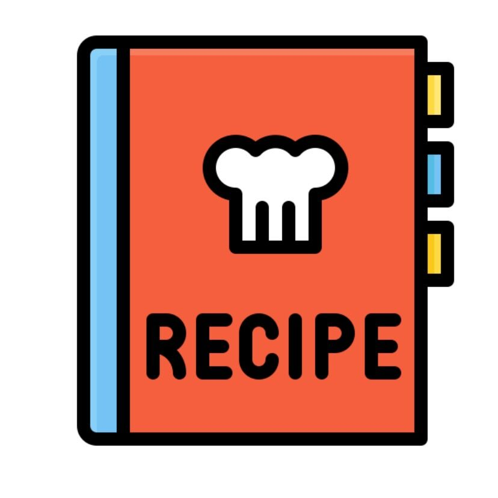

---
tags:
  - Mirko
comments: "true"
---



Any preamble can go here.

## 🧾 Ingredienti

**Section 1**

- bulleted lists
- quantities at the start, e.g.:
- 180 grams butter
- 3 eggs

**Another section**

- Feel free to split your ingredients up
- and add notes underneath
- You don't need any bold headings if you don't want
- 15 of [[Another recipe]], pre-made

## 👩‍🍳 Preparazione

1. Numbered lists
2. Feel free to include any markdown you like in your steps
3. You can also split these up in sections, with bold or level 3+ headings

## 💡 Consigli

Anything else you want can go here.

## Markdown in 5min

### Headers

```
# H1 Header
## H2 Header
### H3 Header
#### H4 Header
##### H5 Header
###### H6 Header
```

### Text formatting

```
**bold text**
*italic text*
***bold and italic***
~~strikethrough~~
`inline code`
```

### Links and images

```
[Link text](https://example.com)
[Link with title](https://example.com "Hover title")


```

### Lists

```
Unordered:
- Item 1
- Item 2
  - Nested item

Ordered:
1. First item
2. Second item
3. Third item
```

### Blockquotes

```
> This is a blockquote
> Multiple lines
>> Nested quote
```

### Code blocks

````
```javascript
function hello() {
  console.log("Hello, world!");
}
```
````

### Tables

```
| Header 1 | Header 2 | Header 3 |
|----------|----------|----------|
| Row 1    | Data     | Data     |
| Row 2    | Data     | Data     |
```

### Horizontal rule

```
---
or
***
or
___
```

### Task lists

```
- [x] Completed task
- [ ] Incomplete task
- [ ] Another task
```

### Escaping characters

```
Use backslash to escape: \* \_ \# \`
```

### Line breaks

```
End a line with two spaces
to create a line break.

Or use a blank line for a new paragraph.
```
