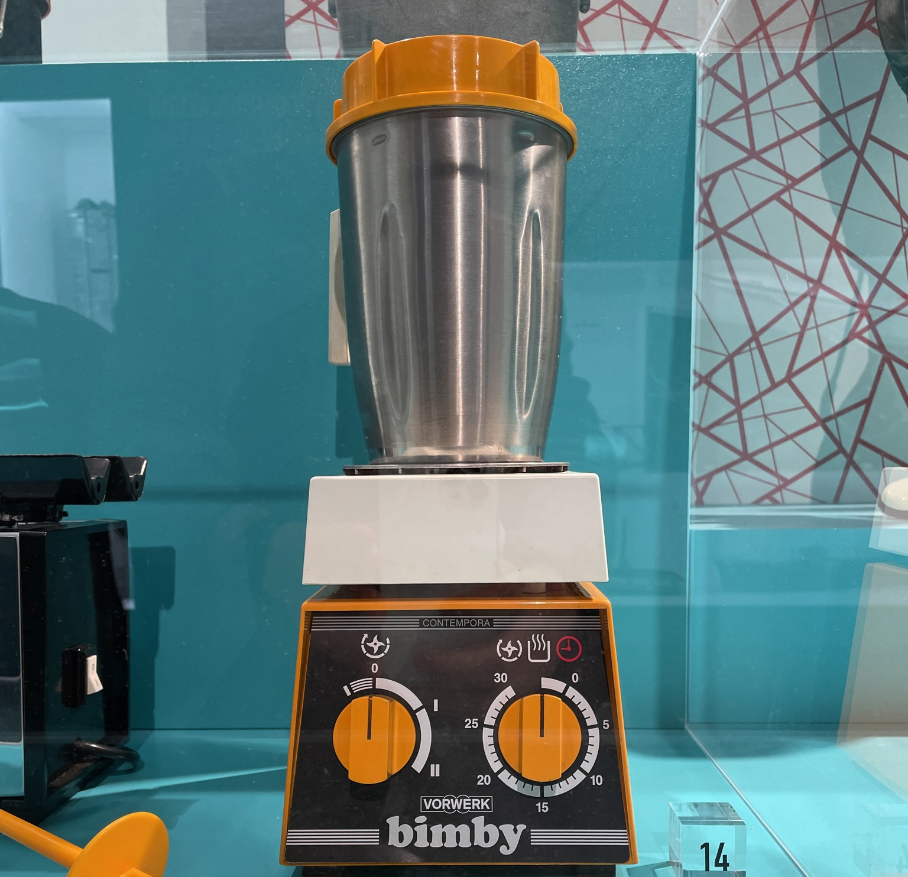

---
tags:
  - Salse
  - Bimby
  - Basi
comments: "true"
---

## 🧾 Ingredients

- 4 persone
- 500 ml Latte
- 50 g Farina 00
- 50 g Burro
- Sale
- Noce moscata

## 👩‍🍳 Directions

- Inserire tutti gli ingredienti
  - 7' - 90° - Vel. 4
