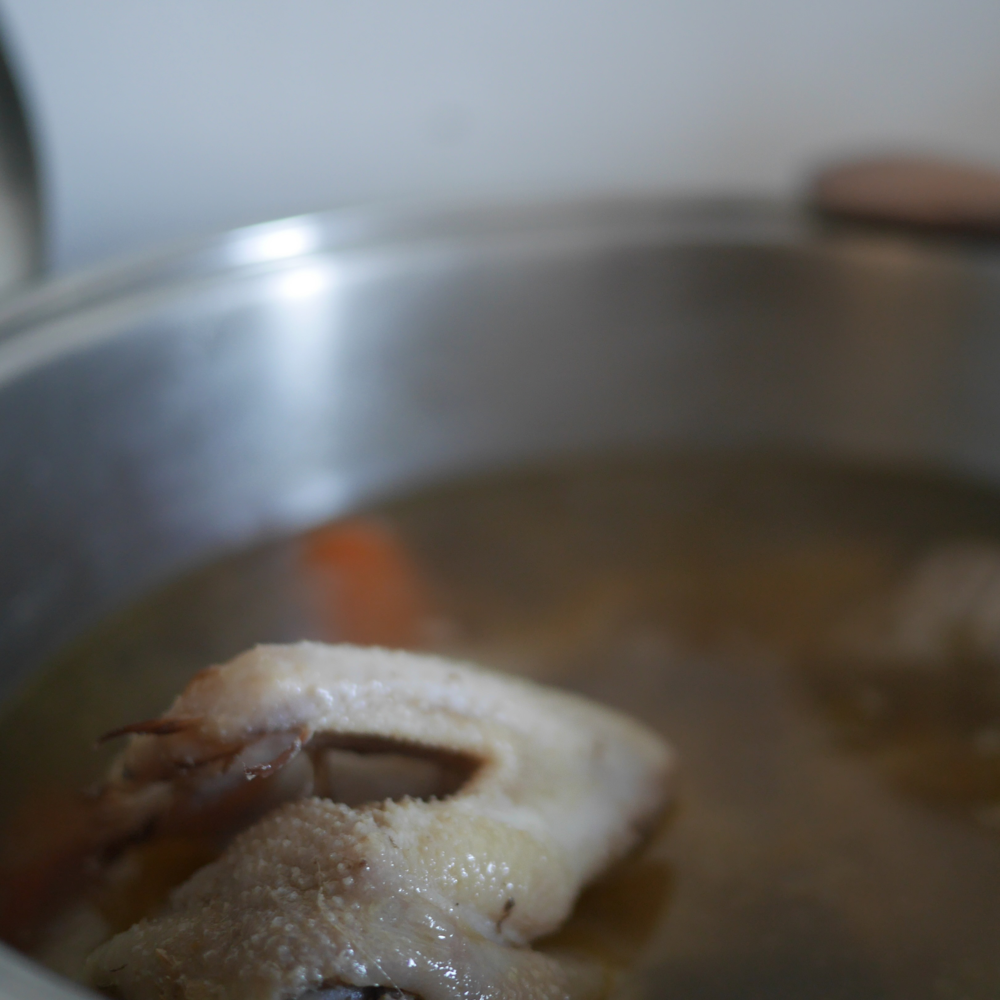

---
tags:
  - NonnaPaola
  - Primi
  - Basi
---

Il brodo di carne delle feste!

## 🧾 Ingredients

**Section 1**

- 500 g Gallina (1/2 Gallina)
- 500 g Muscolo di manzo
- 1 costa Sedano
- 1 Carota
- 1 Cipolla
- 1 Pomodoro
- 1 Chiodo di garofano
- 1 Foglia di alloro
- 1 Bacca di ginepro

## 👩‍🍳 Directions

Mettere la carne e le verdure intere in una grossa pentola con alcuni litri d'acqua e bollire a fuoco basso per 2-4 ore senza coperchio. Rimuovere la schiuma dalla superficie di tanto in tanto con una schiumarola.

A fine cottura filtrare con un panno di cotone neutro alimentare.

Salare all'occorrenza.

## 💡 Tips

Piantare il chiodo di garofano nella cipolla intera.

Ottimo per i tortellini!
