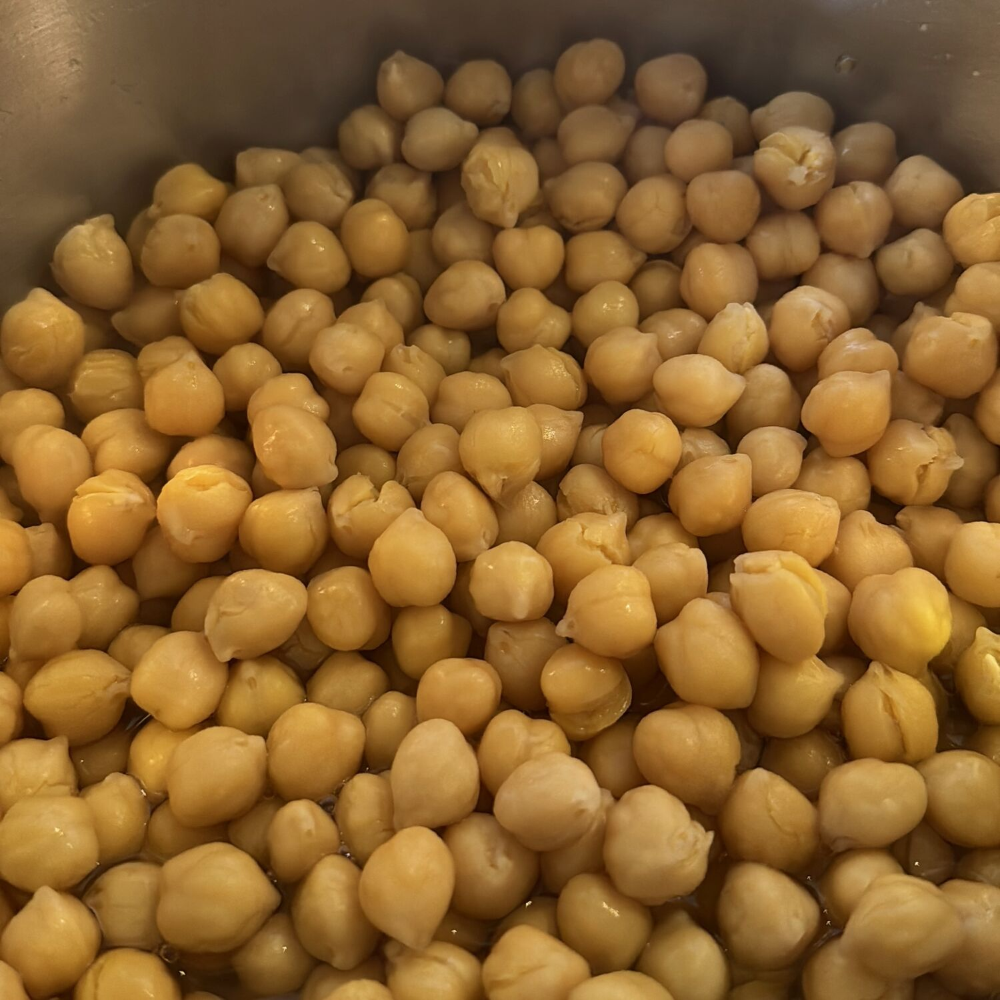

---
tags:
  - Basi
  - Ceci
comments: "true"
---

## 🧾 Ingredients

- 250 g Ceci secchi

## 👩‍🍳 Directions

- Coprire di acqua e lasciare in ammollo per 24-72h cambiando l'acqua ogni giorno
- Cuocere in pentola a pressione coperti da 1 o 2 dita d'acqua per 45' dal fischio a fuoco basso

## 💡 Tips

- 250 g di ceci secchi diventeranno circa 750 g di ceci cotti!

- Una volta cotti si possono conservare in barattolo o in busta ziplock in frigo o in freezer. Conservare l'acqua di cottura (acqua faba).
- L'acqua faba può sostituire le uova in alcune ricette, anche per la maionese.
