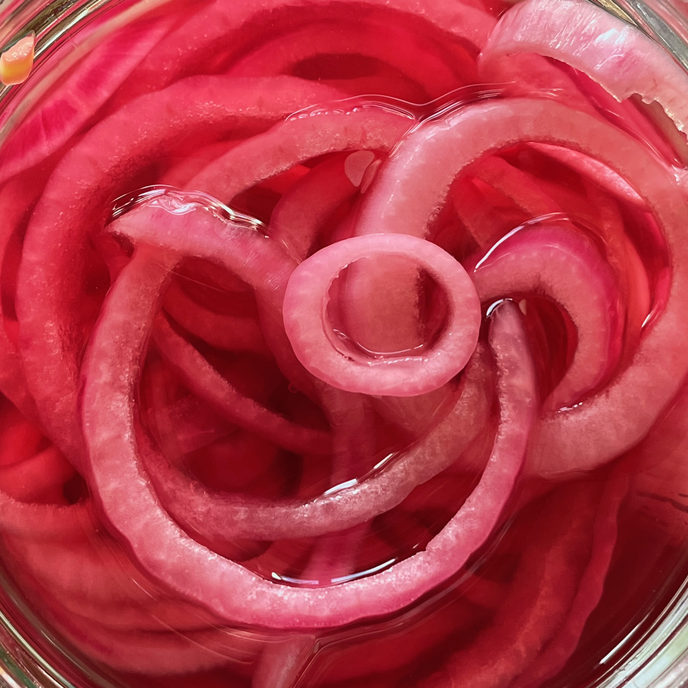

---
tags:
  - Sottaceti
  - Cipolle
  - AdamRagusea
  - Antipasti
comments: "true"
---

## 🧾 Ingredients

- 1 Cipolla a fette sottili (Mandolina)
  - Alternativamente Cetriolini interi, Carote Julienne, Cipolline
- 50% Aceto
- 50% Acqua
- 1 cucchiaio di Zucchero (opzionale)
- Sale

## 👩‍🍳 Directions

1. Inserire le verdure in un barattolo
2. Riempire il barattolo della soluzione di acqua, aceto sale e zucchero

## 💡 Tips

Si conserva in frigo per massimo 2 settimane
