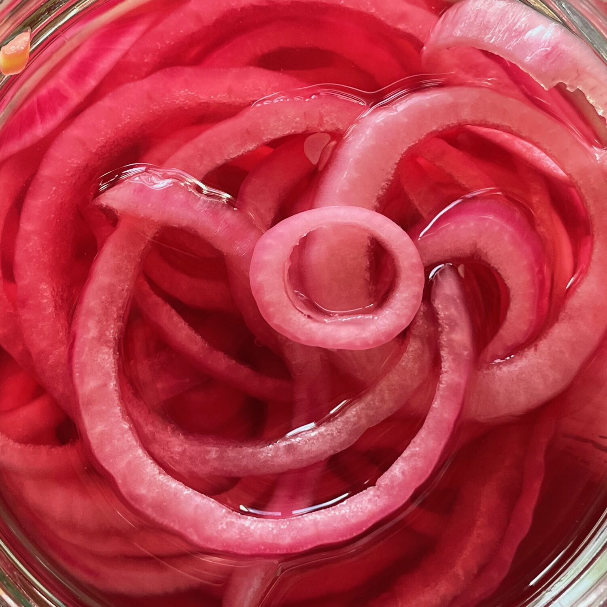

______________________________________________________________________

tags:

- Sottaceti
- Cipolle
- AdamRagusea
- Antipasti
  comments: "true"

______________________________________________________________________

## 🧾 Ingredienti

- 1 Cipolla a fette sottili (Mandolina)
  - Alternativamente Cetriolini interi, Carote Julienne, Cipolline
- 50% Aceto
- 50% Acqua
- 1 cucchiaio di Zucchero (opzionale)
- Sale

## 👩‍🍳 Preparazione

1. Inserire le verdure in un barattolo
1. Riempire il barattolo della soluzione di acqua, aceto sale e zucchero (a freddo per un colore e una consistenza migliori)

## 💡 Consigli

Si conserva in frigo per massimo 2 settimane
