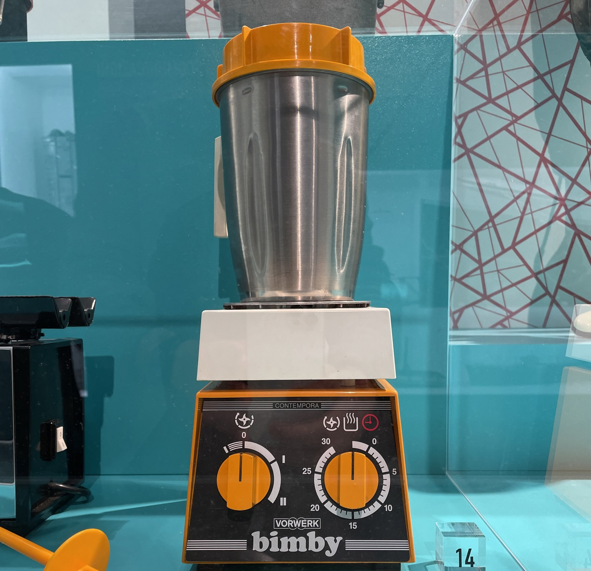

## 🧾 Ingredienti

**Dose per farcire una torta da 26cm**

- 4 Tuorli
- 20 g Fecola
- 30 g Farina 00
- 50 g Zucchero
- 400 ml Latte intero
- 1 Limone (buccia, solo parte gialla)

**Dose ridotta**

- 3 Tuorli (o 1 Uovo e 1 Tuorlo)
- 15 g Fecola
- 20 g Farina 00
- 35 g Zucchero
- 300 ml Latte intero
- 1 Limone (buccia, solo parte gialla)

## 👩‍🍳 Preparazione

- Polverizza lo zucchero e la buccia di limone
  - 20" Vel. Turbo
- Unire tutti gli ingredienti
  - 7' Vel. 4, 80°

## 💡 Consigli

Sa crema resta un po' più liquida di quella fatta a mano, cuocere più a lungo. Per provare la consistenza metterne una piccola quantità in un piattino per farla raffreddare.
