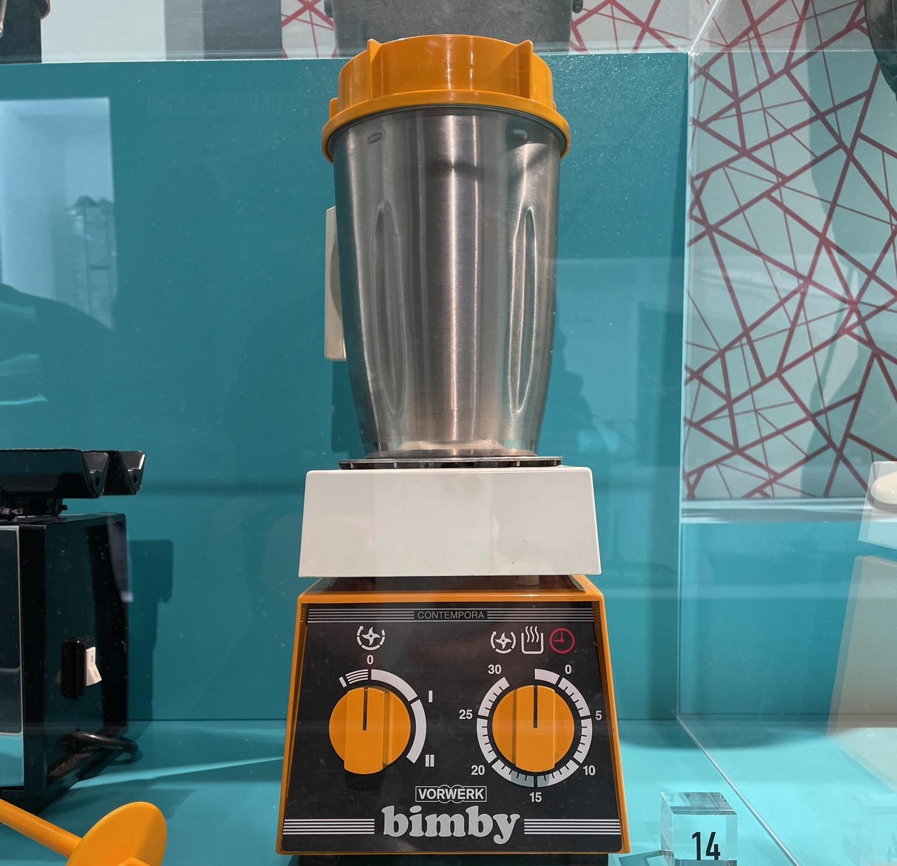

---
tags:
- Dolci
- Creme
- Bimby
- Basi
---

## 🧾 Ingredients

- 26 cm di torta
- 4 Tuorli
- 50 g Farina 00
- 100 g Zucchero
- 400 ml Latte
- 1 Buccia di limone

## 👩‍🍳 Directions

- Polverizza lo zucchero e la buccia di limoneNumbered lists
	- 20" Vel. Turbo
- Unire tutti gli ingredienti
	-  7' Vel. 4, 80°

## 💡 Tips

La crema resta un po' piu' liquida di quella fatta a mano, cuocere piu' a lungo se necessario. Per provare la consistenza metterne una piccola quantita' in un piattino per farla raffreddare.

