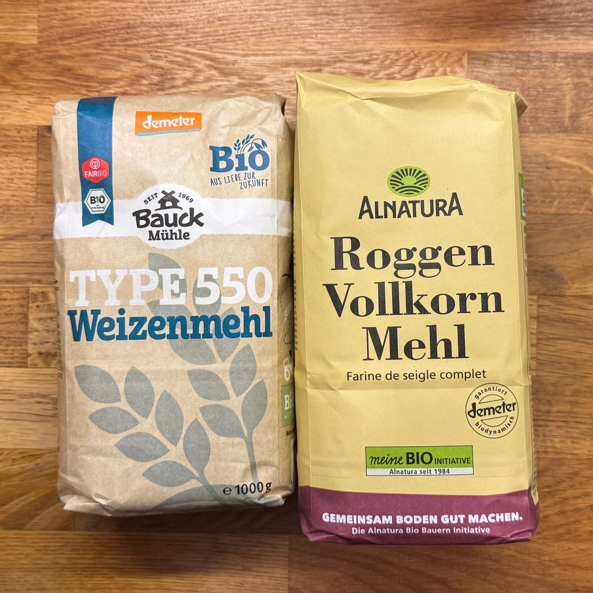

Tabella conversione Italia Germania

| Farina italiana                           | Farina tedesca                  |
| ----------------------------------------- | ------------------------------- |
| Farina 00                                 | Weizenmehl 405                  |
| Farina 0                                  | Weizenmehl 550                  |
| Farina 1                                  | Weizenmehl 630 - 812            |
| Farina 2                                  | Weizenmehl 1050                 |
| Farina integrale                          | Weizenmehl 1600 o Vollkorn Mehl |
| Farina di farro                           | Dinkelmehl 630                  |
| Farina di grano saraceno                  | Buchweizenmehl                  |
| Farina di segale                          | Roggen Mehl                     |
| Farina di semola rimacinata di grano duro | Hartweizengrieß                 |

Il numero del sistema tedesco si riferisce alla quantità di ceneri residue (mg per 100g di farina).

Un altro numero importante da tenere d'occhio e' il valore nutrizione relativo alle proteine (Eiweiss o Eiklar in tedesco) per 100g. Il valore è anche detto _forza_ della farina. Per i dolci un valore fino a 10g, per il pane o la pizza meglio che sia almeno 12g o 13g. Il valore corrisponde alla quantità di glutine (una proteina) presente nella farina, che favorisce l'elasticità dell'impasto.
