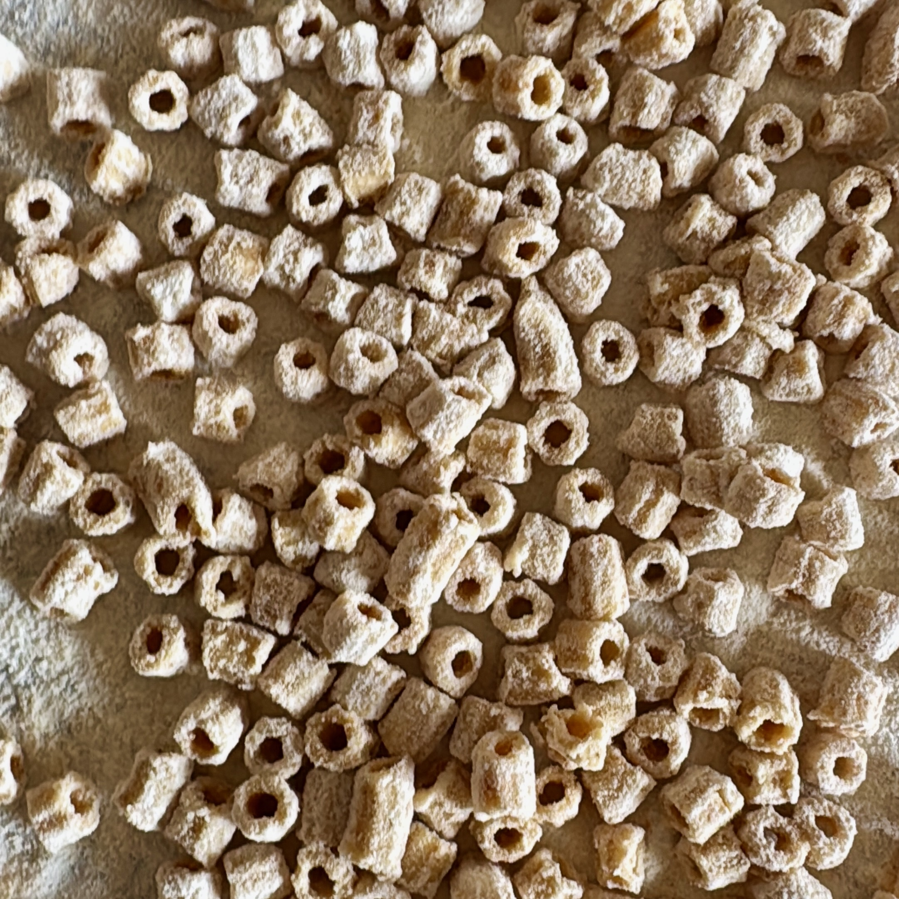

---
tags:
  - Pasta
  - Uova
  - Primi
  - Kenwood
  - Basi
comments: "true"
---

## 🧾 Ingredients

- 3 Servings
- 2 Uova o 32g di acqua
- 160-200 g Farina di Semola

## 👩‍🍳 Directions

- Impastare in modo da formare uno sfarinato omogeneo. Velocita' 3 con frusta K, aggiungendo l'acqua a filo partendo dalla sola farina.
- Passare al torchio
![[pasta-al-torchio-kenwood.jpeg]]
- Cucinare subito (non e' facile seccare la pasta senza che si sfaldi e diventi friabile)

