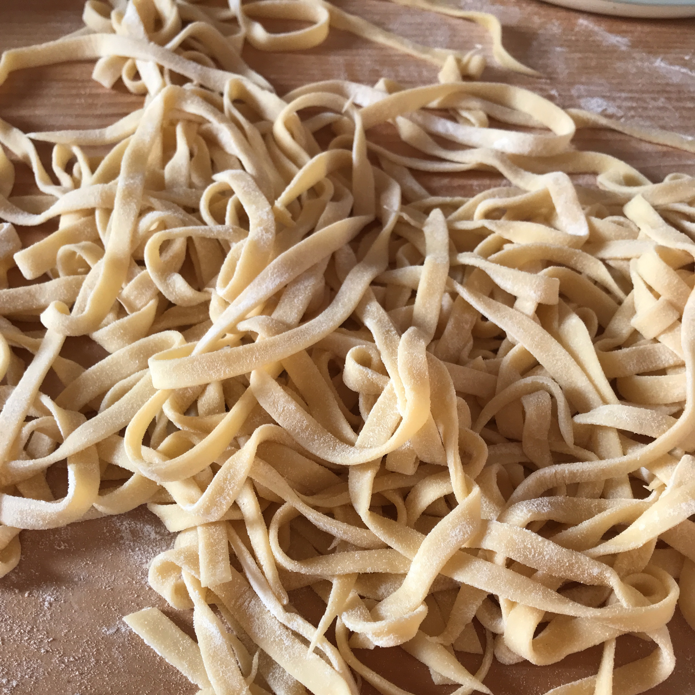

---
tags:
  - Pasta
  - Uova
  - Primi
  - NonnaAda
  - Basi
comments: "true"
---

## 🧾 Ingredienti

- 3 Servings
- 2 Uova
- 80 g Farina tipo 0
- 80 g Farina di Semola

## 👩‍🍳 Preparazione

- Impastare a mano su una spianatoia, facendo un vulcano di farina con le uova al centro, mescolando inizialmente con la forchetta per dare consistenza alle uova e poi a mano fino a che l'impasto non risulta compatto ed elastico
- In alternativa impastare nella planetaria con frusta K
- Lasciare riposare una mezz'ora coperta prima di procedere a stendere la pasta

## 💡 Consigli

- Usare spessore 2 per lasagne e ravioli
- Usare spessore 1 o 2 per tortellini e cappelletti
