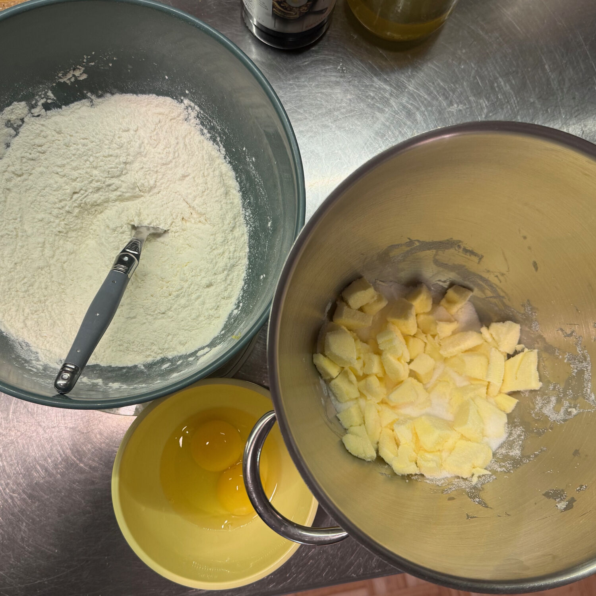

---
tags:
  - daniela
comments: "true"
---

## 🧾 Ingredienti

- 170 g Burro morbido
- 130 g Zucchero semolato
- 1 Uovo intero
- 1 Tuorlo
- 330 g Farina 00
- Sale
- 1/2 Cucchiaino di lievito per dolci
- Vaniglia
- Buccia di limone grattugiata

## 👩‍🍳 Preparazione

1. Montare il burro con lo zucchero
2. Aggiungere le uova un po' alla volta e incorporare bene
3. Aggiungere la farina mescolata al sale, lievito e aromi tutta in una volta

Formare una palla e mettere il frigo per 40', quindi stendere con un matterello (1/2 cm)

## 💡 Consigli

Ottima per crostate di marmellata e biscotti.
