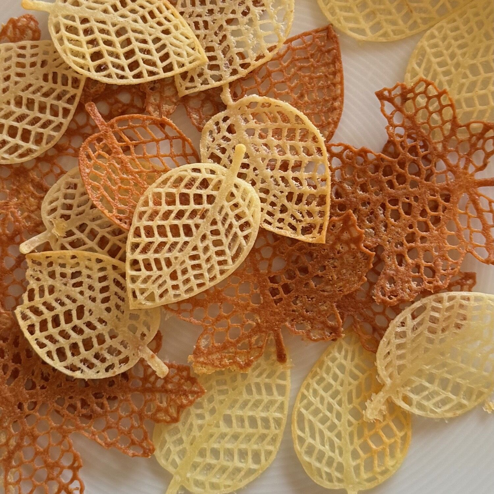
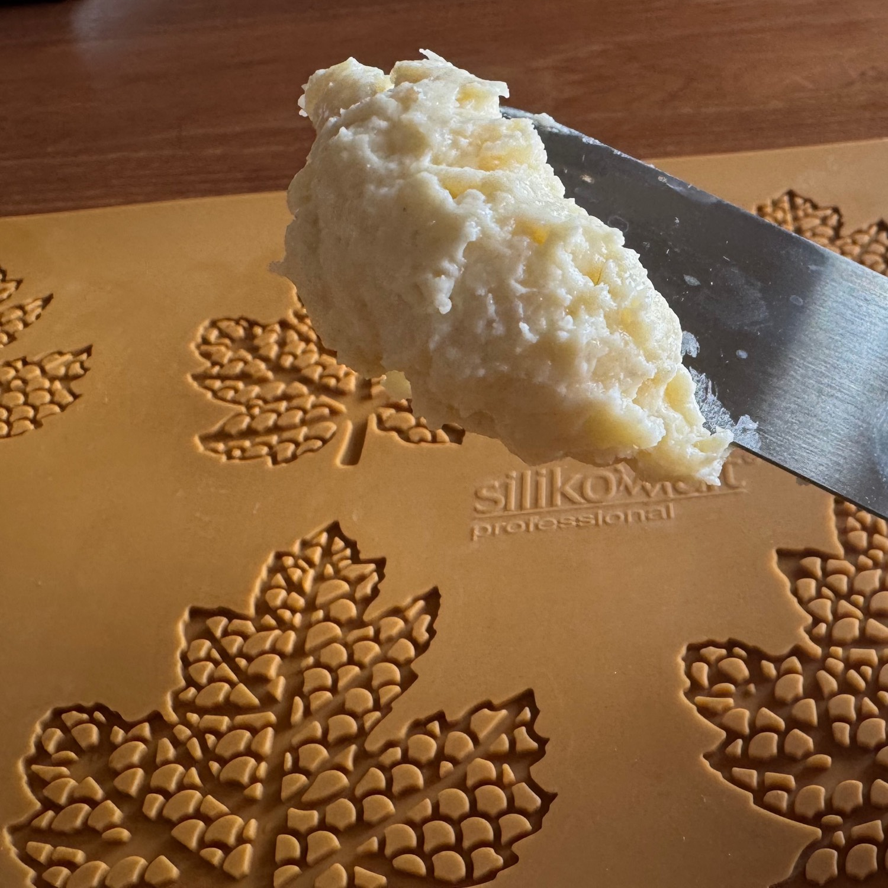

______________________________________________________________________

tags:

- Decorazioni
- Basi
  comments: "true"

______________________________________________________________________

## 🧾 Ingredienti

- 20 g Burro
- 20 g Farina
- 20 g Formaggio grattugiato
- 20 g Albume

## 👩‍🍳 Preparazione

1. Mescolare fino ad ottenere un impasto omogeneo
1. Lavorare sullo stampo in silicone con una spatola.
1. Infornare a 160º ventilato per pochi minuti (~6)

