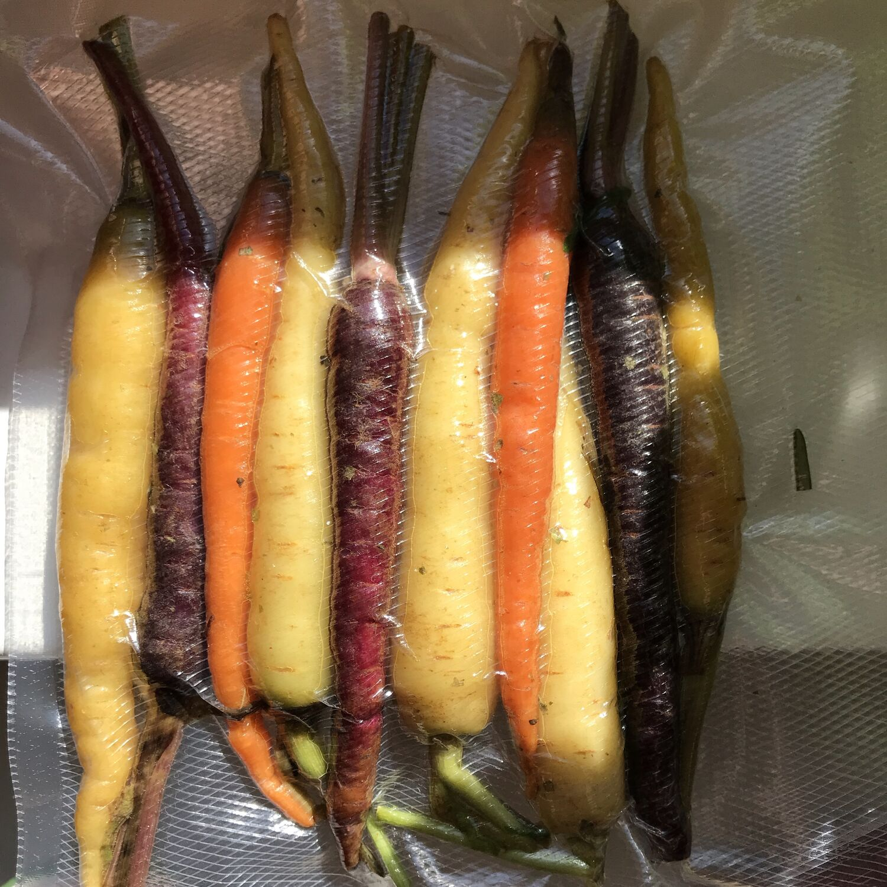

---
tags:
  - SousVide
  - Mirko
  - Basi
comments: "true"
---

## 👩‍🍳 Cooking times

### Carne e pesce

| Tipo                  | Temperatura | Tempo |
| --------------------- | ----------- | ----- |
| Roastbeef             | 55°         | >2h   |
| Roastbeef (stracotto) | 57.5°       | 8h    |
| Hamburger             | 56°         | 1h    |
| Bistecca vitello      | 55°         | 1h    |
| Maiale                | 62°         | >2h   |
| Pollo                 | 65-68°      | >2h   |
| Polpo                 | 77°         | 4h    |

### Verdure

| Tipo       | Temperatura | Tempo |
| ---------- | ----------- | ----- |
| Finocchi   | 80°         | 2h    |
| Carote     | 80°         | 2h    |
| Funghi     | 80°         | 1h    |
| Asparagi   | 82°         | 10'   |
| Broccoli   | 90°         | 20'   |
| Cavolfiore | 90°         | 20'   |
| Rapa       | 90°         | 20'   |
| Carciofi   | 90°         | 30'   |
| Patate     | 90°         | 1h    |

### Uova

| Tipo         | Temperatura | Tempo            |
| ------------ | ----------- | ---------------- |
| Ramen        | 90°         | 8' + raffreddare |
| Poached      | 64°         | 1h               |
| Pastorizzate | 55°         | >2h              |

