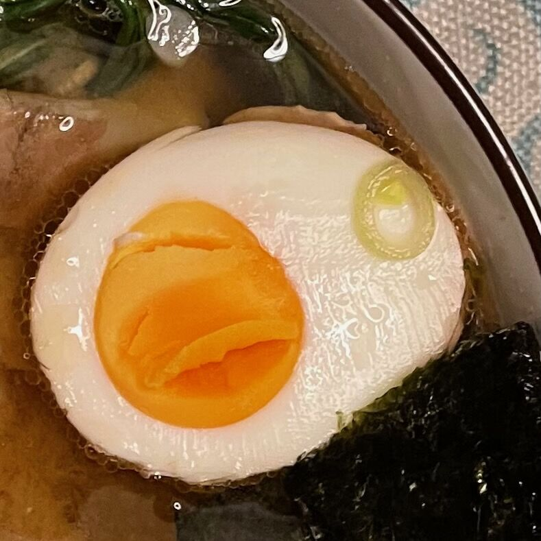

---
tags:
- Uova
- Basi
---

## 🧾 Ingredients

- 1 Uovo a temperatura ambiente (si rompe meno facilmente)
- 1 pentolino d'acqua

## 👩‍🍳 Directions

Immergere le uova nell'acqua bollente con cautela

| Modo       | Tempo      |
| ---------- | ---------- |
| Alla coque | 3-4 minuti |
| Barzotte   | 5-6 minuti |
| Sode       | 7-8 minuti |

Rimuovere le uova dall'acqua calda e lasciare raffreddare. 

## 💡 Tips

Per le uova sode, per fermare la cottura e facilitare la rimozione della buccia, si possono immergere in acqua molto fretta subito dopo la cottura. Se si raffreddano le uova dopo la cottura, aggiungere un minuto.

