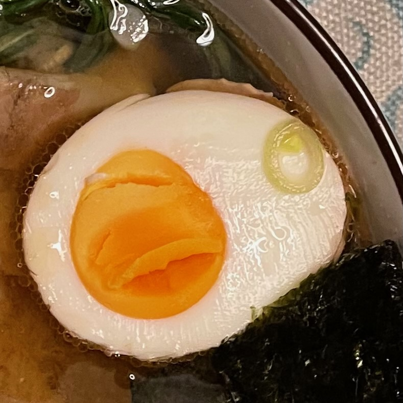

## 🧾 Ingredienti

- 1 Uovo a temperatura ambiente (si rompe meno facilmente)
- 1 pentolino d'acqua

## 👩‍🍳 Preparazione

Immergere le uova nell'acqua bollente con cautela

| Modo       | Tempo      |
| ---------- | ---------- |
| Alla coque | 3-4 minuti |
| Barzotte   | 5-6 minuti |
| Sode       | 7-8 minuti |
| In camicia | 3-4        |

Rimuovere le uova dall'acqua calda e lasciare raffreddare.

## 💡 Consigli

Per le uova sode, per fermare la cottura e facilitare la rimozione della buccia, si possono immergere in acqua molto fretta subito dopo la cottura. Se si raffreddano le uova dopo la cottura, aggiungere un minuto.
