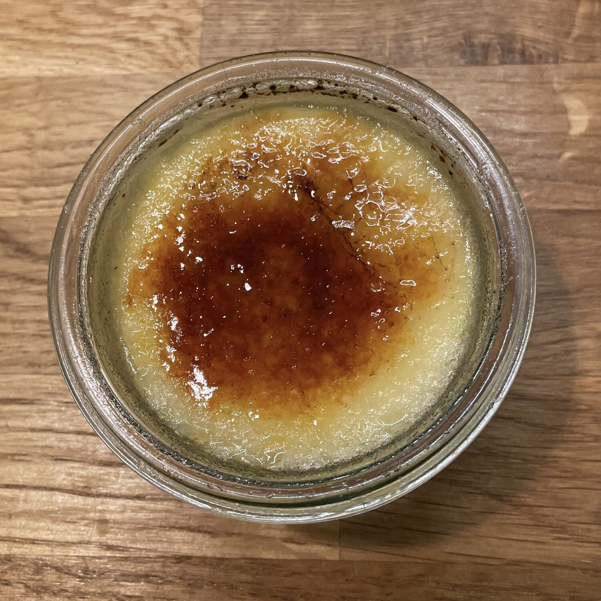
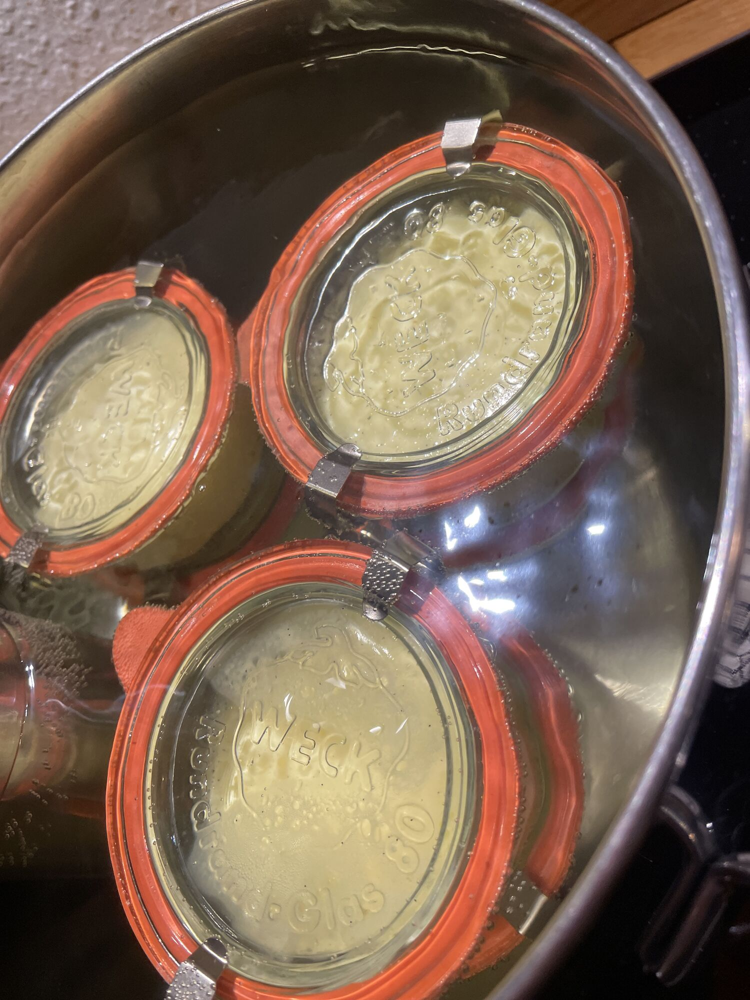

---
tags:
  - Dolci
  - Creme
  - SousVide
  - Uova
comments: "true"
---

## 🧾 Ingredients

**Crème**

- 9 Tuorli
- 90 g Zucchero
- 3 g Sale
- 600 g Panna

**Brûlée**

- Zucchero
- Cannello da cucina a gas

## 👩‍🍳 Directions

Riscaldare un contenitore capiente pieno d’acqua a 80° con il riscaldatore sous-vide.

Mescolare i tuorli con lo zucchero.

Aggiungere la panna liquida e mescolare senza incorporare aria.

Dividere in contenitori richiudibili in 5 o 6 porzioni da 150g circa (eg Weck Gourmet Jars 165 ml Jars RR80 with Glass Lid).

Se si sono formare bolle in superficie, scoppiarle con il bruciatore.

Chiudere i barattoli senza stringere troppo.

Immergere nel bagno a 80° per un’ora.

Raffreddare in acqua fredda e conservare in frigo per massimo una settimana.

All’uso cospargere di zucchero e caramellarlo con il bruciatore.

## 💡 Tips

Non dirigere il bruciatore verso il bordo del barattolo, il vetro potrebbe rompersi per il calore.
