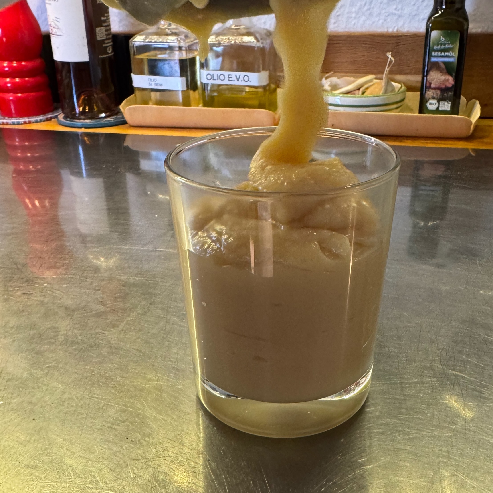

---
tags:
  - Bimby
  - Creme
  - Dolci
comments: "true"
---

La crema mou da spalmare sul pane o da versare su gelato, waffel o pancakes.

## 🧾 Ingredients

- 1 l Latte
- 250 g Zucchero
- opzionale i semi di una bacca di vaniglia

## 👩‍🍳 Directions

1. Inserire tutti gli ingredienti nel barattolo del Bimby
2. Varoma, 1h, Vel. 4

## 💡 Tips

Dopo un’ora controllare densità (in un piattino per raffreddarla) e il colore (dovrebbe caramellare un po’).

