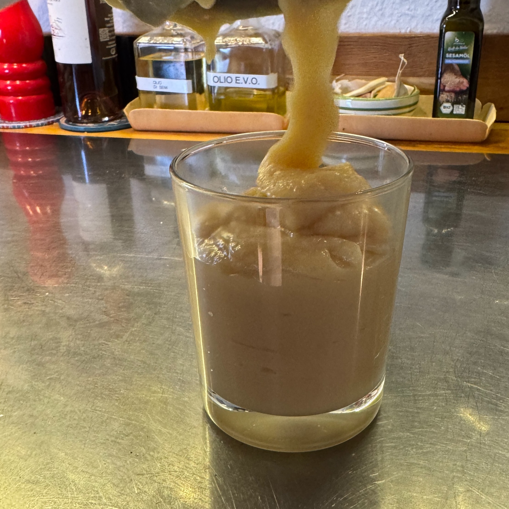

La crema mou da spalmare sul pane o da versare su gelato, waffel o pancakes.

## 🧾 Ingredienti

- 1 l Latte
- 250 g Zucchero
- opzionale i semi di una bacca di vaniglia

## 👩‍🍳 Preparazione

1. Inserire tutti gli ingredienti nel barattolo del Bimby
2. Varoma, 1h, Vel. 4

## 💡 Consigli

Dopo un’ora controllare densità (in un piattino per raffreddarla) e il colore (dovrebbe caramellare un po’).
