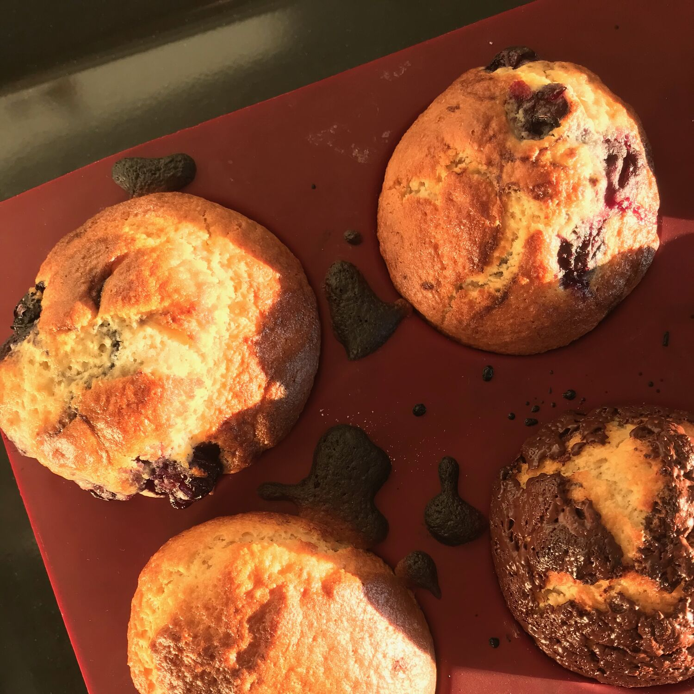

---
tags:
  - Dolci
  - Colazione
comments: "true"
---

## 🧾 Ingredients

- 12 Muffin

**Polveri**

- 4 tazze Farina di Farro 630
- 1 cucchiaio Sale
- 1 tazza Zucchero (mascobado)
- 1 bustina Vaniglia
- 1 bustina Lievito

**Liquidi**

- 2 Uova
- 2 tazze Latte
- 1/2 tazza Olio di semi

## 👩‍🍳 Directions

1. Accendere il forno a 180°
2. Mescolare gli ingredienti in polvere
3. Mescolare i liquidi
4. Aggiungere i liquidi alle polveri e mescolare appena
5. Inserire nelle tegliette da muffin, fino a 3/4
6. Spolverare di zucchero
7. Informare 20' circa

## 💡 Tips

- Aggiungere a piacere nell'impasto o nel pirottino uvetta, mosche di cioccolato, mirtilli, ecc.
