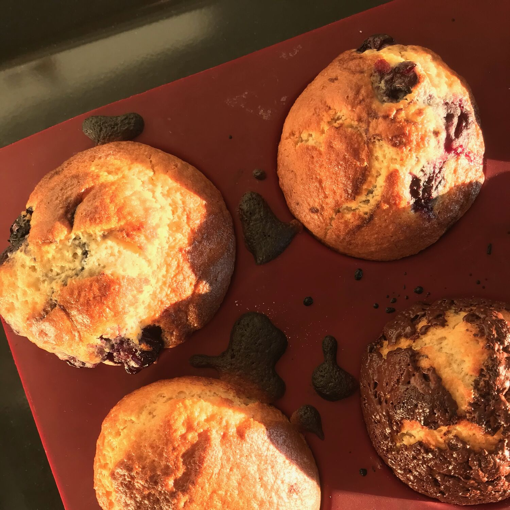

______________________________________________________________________

tags:

- Dolci
- Colazione
  comments: "true"

______________________________________________________________________

## 🧾 Ingredienti

- 12 Muffin

**Polveri**

- 4 tazze Farina di Farro 630
- 1 cucchiaio Sale
- 1 tazza Zucchero (mascobado)
- 1 bustina Vaniglia
- 1 bustina Lievito

**Liquidi**

- 2 Uova
- 2 tazze Latte
- 1/2 tazza Olio di semi

## 👩‍🍳 Preparazione

1. Accendere il forno a 180°
1. Mescolare gli ingredienti in polvere
1. Mescolare i liquidi
1. Aggiungere i liquidi alle polveri e mescolare appena
1. Inserire nelle tegliette da muffin, fino a 3/4
1. Spolverare di zucchero
1. Informare 20' circa

## 💡 Consigli

- Aggiungere a piacere nell'impasto o nel pirottino uvetta, mosche di cioccolato, mirtilli, ecc.
