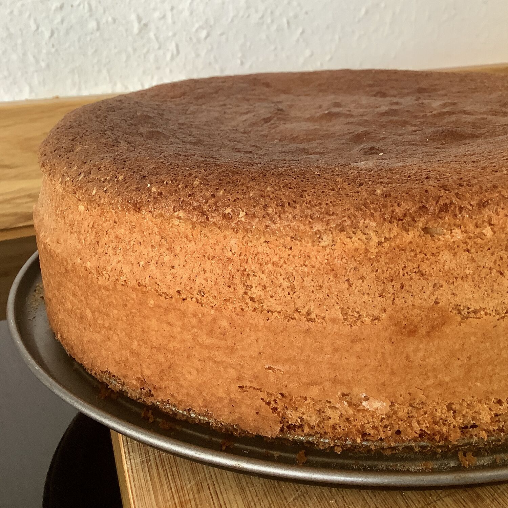

---
tags:
  - Dolci
  - Torte
  - NonnaPaola
comments: "true"
---

La ricetta originale di Nonna Paola

## 🧾 Ingredienti

- 8 uova
- 260 g Zucchero
- 200 g Farina 00
- 1/2 Bustina di lievito per dolci

## 👩‍🍳 Preparazione

- Montare gli albumi a neve fino a che non sono in grado di tenere dritta in piedi una forchetta
- Montare i tuorli con lo zucchero almeno fino a che non cambiano colore e diventano chiari
- Aggiungere ai tuorli il lievito, la farina e gli albumi a neve poco a poco, mescolando con un cucchiaio di legno dal basso verso l'alto (senza smontare i bianchi)
- Inserire in una teglia opportunamente imburrata e infarinata
- Infornare a 170° per circa 50' (verificare con uno stecchino che non sia bagnato al centro)

## 💡 Consigli

- Dose doppia di crema pasticcera.
