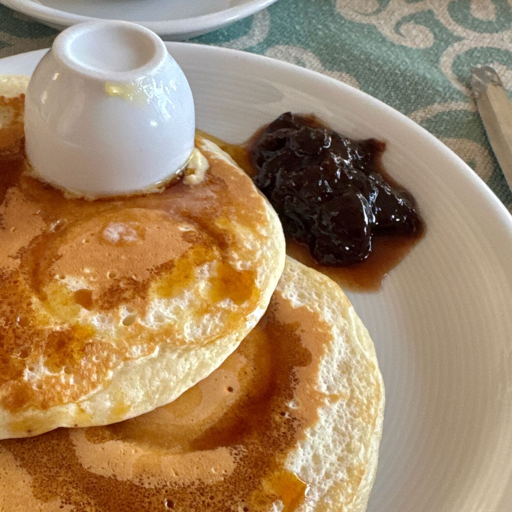

---
tags:
  - Colazione
  - Dolci
  - Cucchiaio
comments: "true"
---

## 🧾 Ingredients

- 3 o 4 Persone
- 100 g Farina 0 (o mix con farina di farro o di grano saraceno per un sapore diverso, o Farina 00 per renderli più soffici)
- 15 g Zucchero
- 1 Uovo
- 1 bicchiere Latte (200ml)
- Olio
- 1/2 Bustina di lievito per dolci
- 1 pizzico Sale

**Condimento**
- Burro
- Marmellata di frutti di bosco
- Sciroppo d'acero
- Mirtilli o Frutta fresca
- Crema Novi
- Crumble di biscotto

## 👩‍🍳 Directions

1. Mescolare i solidi
2. Aggiungere l'uovo e poi i liquidi al centro e mescolare bene
3. Se possibile far riposare l'impasto un paio d'ore (o una notte in frigorifero)
4. Cuocere in padella a 180°

## 💡 Tips

Usare un mestolo (40-50ml) per dosare l'impasto in modo uniforme
