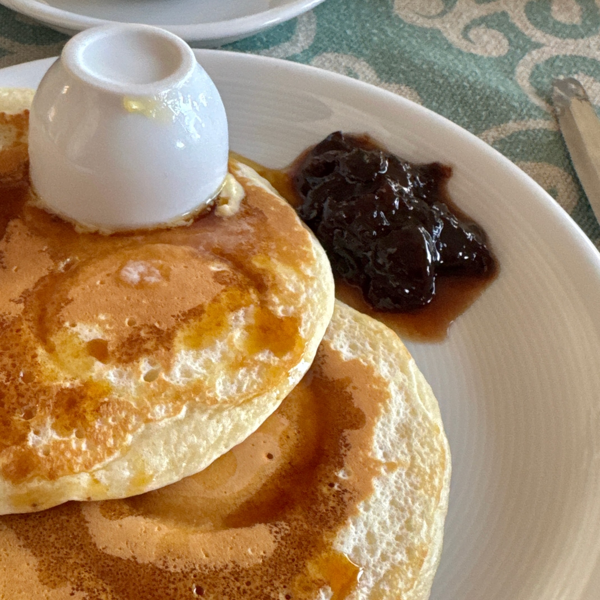

## 🧾 Ingredients

- 3 Persone
- 1 Uovo
- 150 g Farina
- 300 ml Latte
- 50 g Burro fuso
- 1/2 Bustina di lievito per dolci
- 12 g Zucchero
- 5 g Sale

**Condimento**
- Burro
- Marmellata di frutti di bosco
- Sciroppo d'acero
- Mirtilli o Frutta fresca
- Crema Novi
- Crumble di biscotto

## 👩‍🍳 Directions

1. Mescolare i solidi
2. Aggiungere i liquidi al centro e mescolare bene
3. Cuocere in padella a 180°

## 💡 Tips

Usare un mestolo (40-50ml) per dosare l'impasto in modo uniforme

