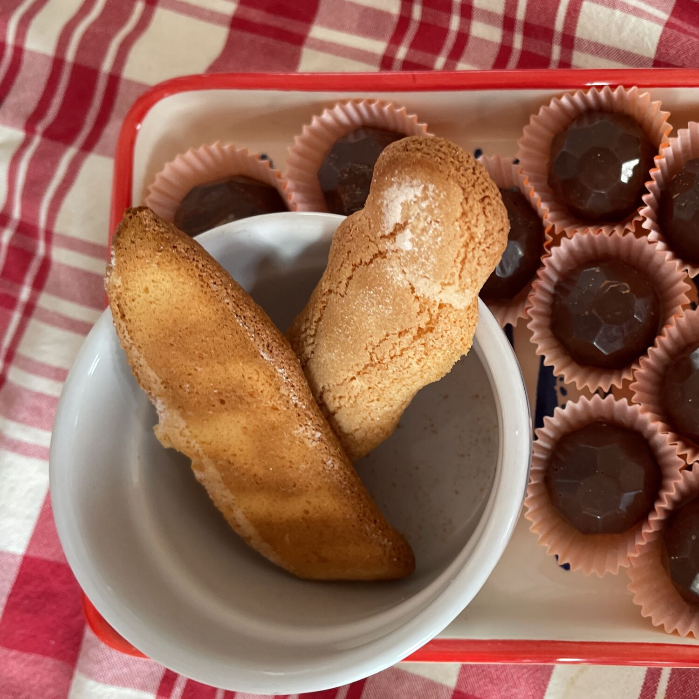

---
tags:
  - Biscotti
  - Dolci
comments: "true"
---

## 🧾 Ingredients
- 4 Uova
- 140 g Farina 00
- 40 g Zucchero (per i tuorli)
- 100 g Zucchero (per gli albumi)
- Zucchero per guarnire
- 25 g Fecola
- 1 bustina Vanillina
- 1 pizzico Sale

## 👩‍🍳 Directions
1. Pre-riscaldare il forno a 200°
2. Montare gli albumi a neve e aggiungere 100 g di zucchero poco a poco
3. Montare tuorli e 40 g di zucchero 
4. Setacciare farina, fecola e vanillina
5. Incorporare i bianchi a neve e le polveri setacciate nei tuorli a poco a poco mescolando con un cucchiaio di legno dal basso verso l'alto
6. Inserire in una sac-a-poche e formare dei vermi ben spaziati su una teglia ricoperta di carta da forno o tappetino in silicone
7. Cospargere i biscotti di zucchero
8. Informare per 10-11'

## 💡 Tips

Esercitare una pressione costante sulla sac-a-poche mentre si formano i biscotti sulla teglia, terminare con un movimento deciso per passare al prossimo. Lasciare due dita tra i biscotti per lasciare lo spazio per crescere in forno.

Ottimi per il tiramisù
