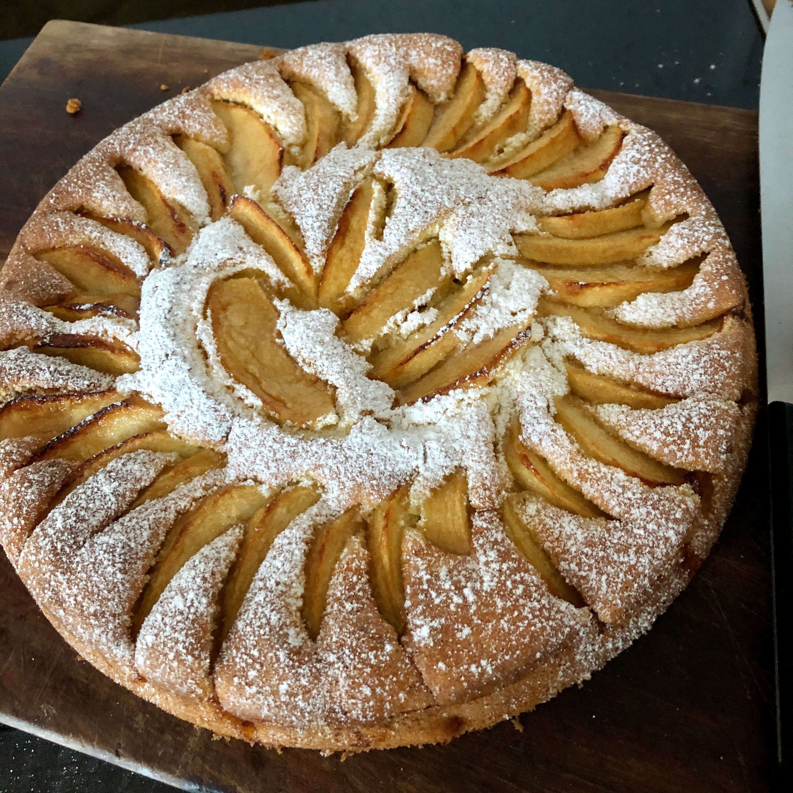

---
tags:
  - Mele
  - Dolci
  - Torte
comments: "true"
---

La prima torta che Mirko abbia mai fatto

## 🧾 Ingredienti

- 80 g Burro
- 100 g Zucchero
- 1 Uovo
- 180 g Farina 00 (erano 200, ma e' troppa)
- 1 o 2 Mele (Golden o Pink Lady)
- 1/2 bustina Lievito per dolci
- q.b. Latte tiepido
- Zucchero per spolverare

## 👩‍🍳 Preparazione

1. Pre-riscaldare il forno a 180°
2. Montare burro e zucchero
3. Aggiungere i tuorli
4. Aggiungere farina, lievito, latte
5. Unire gli albumi a neve (mescolando dolcemente dal basso verso l'alto)
6. Inserire in una teglia imburrata e infarinata
7. Decorare con fettine di mela tagliate sottili (sedicesimi)
8. Spolverare con lo zucchero
9. Informare per circa 45' (provare con uno stecchino sulle labbra se l'impasto al centro e' ancora bagnato)
