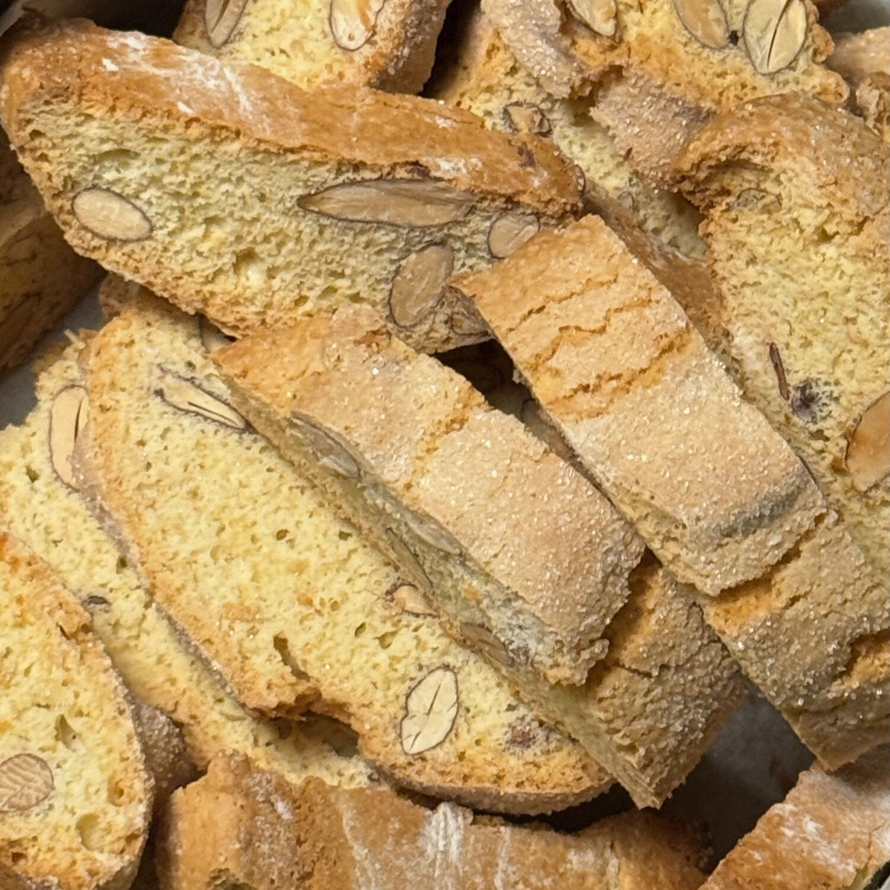

## 🧾 Ingredienti

- 180 g Mandorle (tostate)
- 2 Uova
- 160 g Zucchero + un po' per spolverare
- 250 g Farina 00
- 25 g Burro
- 1/2 Bustina di lievito
- Anice
- Buccia o estratto di limone

## 👩‍🍳 Preparazione

1. Tostare le mandorle (metterle nel forno a freddo, 20' a 160º ventilato, ripiano centrale nella leccarda)
2. Sciogliere il burro e rinvenire l'anice e la buccia di limone nel burro intiepidito per qualche minuto
3. Mescolare tutti gli ingredienti (salvo le mandorle)
4. Se l'impasto e' troppo morbido aggiungere un po' di farina
5. Incorporare le mandorle dopo averle lasciate raffreddare un po' e averle strofinate in uno strofinaccio.
6. Disporre sulla leccarda dei bastoncini di impasto larghi 3cm e alti 2cm a una certa distanza tra loro.
7. Informare per 20' a 180º
8. Lasciare raffreddare
9. Tagliare a fette di 1 o 2 cm.
10. Disporre sulla leccarda e informare altri 10' per lato a 180º

## 💡 Consigli

Servire con vin santo o passito.
