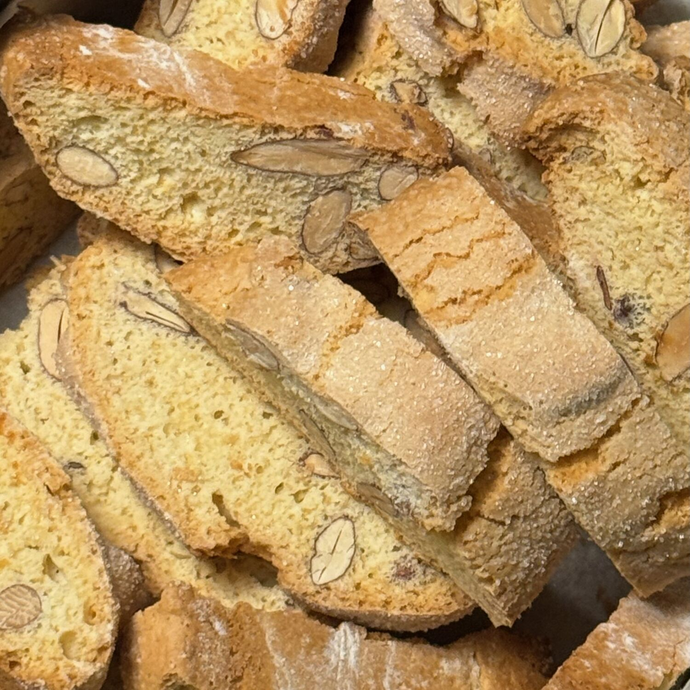

## 🧾 Ingredienti

- 180 g Mandorle (tostate)
- 2 Uova
- 160 g Zucchero + un po' per spolverare
- 250 g Farina 00
- 25 g Burro
- 1/2 Bustina di lievito
- 1 stella di anice stellato essiccato oppure semi di anice q.b.
- Scorza grattugiata di 1 limone oppure 1 goccia di estratto oleoso di limone alimentare

## 👩‍🍳 Preparazione

1. Disporre le mandorle sulla leccarda, sul ripiano centrale, partendo dal forno freddo. Impostare 160 °C ventilato e tostare per circa 10–15 minuti dall’accensione, controllando il colore e sfornandole prima che imbruniscano.
2. Sciogliere dolcemente il burro senza farlo dorare. Togliere dal fuoco, aggiungere l'anice e lasciare in infusione per 20 minuti, mantenendo il burro tiepido e liquido. Rimuovere la stella; se si usano semi o restano frammenti, filtrare con un colino fine. Aggiungere al burro la scorza di limone oppure la goccia di estratto oleoso.
3. Mescolare tutti gli ingredienti (salvo le mandorle)
4. Se l'impasto e' troppo morbido aggiungere un po' di farina
5. Incorporare le mandorle dopo averle lasciate raffreddare un po' e averle strofinate in uno strofinaccio.
6. Disporre sulla leccarda dei bastoncini di impasto larghi 3cm e alti 2cm a una certa distanza tra loro.
7. Infornare per 20' a 180º
8. Lasciare raffreddare
9. Tagliare a fette di 1 o 2 cm.
10. Disporre sulla leccarda e infornare altri 10' per lato a 180º

## 💡 Consigli

Servire con vin santo o passito.
