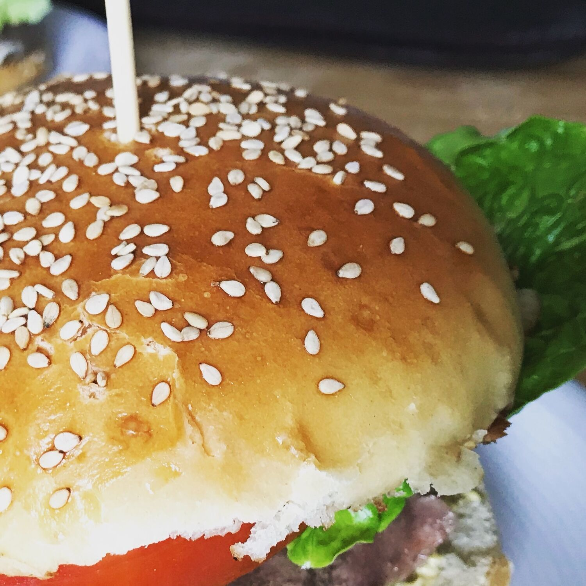
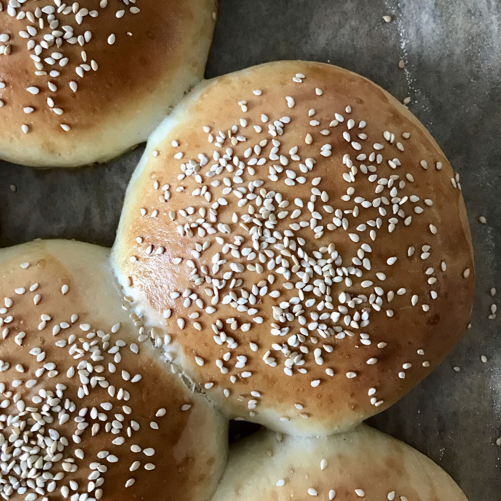

______________________________________________________________________

tags:

- Mirko
- Allrecipes
  comments: "true"

______________________________________________________________________

Adattato da https://www.allrecipes.com/recipe/233652/homemade-hamburger-buns/

## 🧾 Ingredienti

- 7 g lievito di birra secco (o 21 di lievito di birra fresco)
- 450 g Farina 00
- 240 ml Acqua tiepida
- 2 Uova
- 45 g Burro
- 35 g Zucchero
- 7 g Sale
- 5 ml Olio
- 15 ml Latte
- Semi di sesamo

## 👩‍🍳 Preparazione

1. Sciogliere il lievito in mezza tazza di farina nell'acqua tiepida in una ciotola
1. Riposare 10'
1. Sbatti 1 uovo, il burro fuso, lo zucchero e il sale nella ciotola con il lievito
1. Aggiungi il resto della farina
1. Usa il gancio del robot da cucina per impastare il tutto a velocita' bassa per 5 o 6 minuti
1. L'impasto dovrebbe essere liscio ed elastico, non troppo appiccicoso
1. Rovescia l'impasto sulla spianatoia e fai una palla
1. Metti l'impasto a lievitare in una ciotola pulita e unta.
1. Lascia lievitare per circa 2 ore fino a raddoppio (usa un contenitore graduato o cilindrico)
1. Trasferisci sulla spianatoio infarinata, forma un rettangolo also circa 1 centimetro e mezzo
1. Taglia in 8 pezzi uguali
1. Forma delle palline premendo con la mano aperta e facendo movimenti circolari (pirlatura)
1. Disponi le palline su una teglia, non troppo distanziate in modo che si toccheranno durante la cottura.
1. Lasciare lievitare coperte con un panno unodo per circa un ora
1. Accendi il forno.
1. Il secondo uovo va mescolato con un po' di latte e serve per spalmare le pagnottine prima di cospargerle di sesamo
1. Informare a 180 gradi per 15-17 minuti

