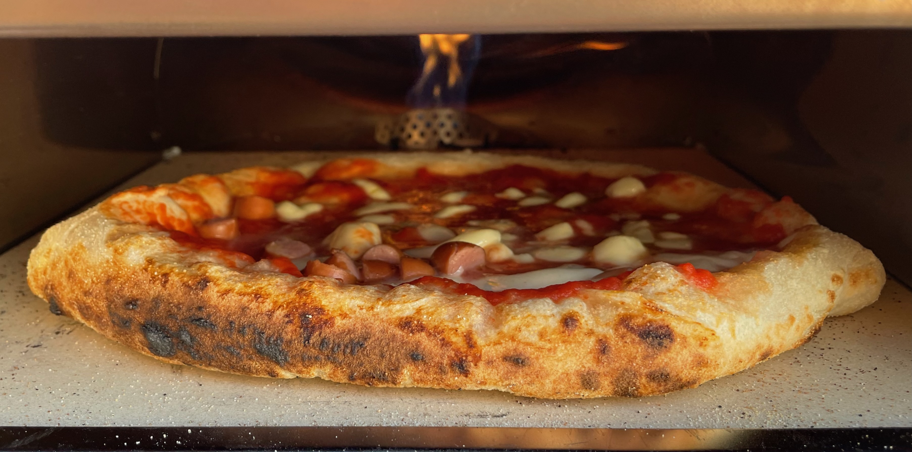

---
tags:
  - Pizza
  - Stefano
  - Youbakeit
comments: "true"
---

## 🧾 Ingredienti

- 2 Servings
- 350 g Farina manitoba (Farina forte con almeno 12 o 13g di proteine per 100g)
- 210 ml Acqua (60% idratazione)
- 7 g Sale fino
- 3 g Lievito di birra

## 👩‍🍳 Preparazione

Per cuocere la pizza a pranzo iniziare l'impasto verso le 11 del mattino **del giorno prededente**, per la sera, iniziare alle 18 del giorno precedente

- Mettere tutti gli ingredienti nella planetaria e mescolare per almeno 5-6 minuti
- Trasferire sul piano di lavoro e lavorare un altro minuto per avere un impasto liscio
- Formare una palla, metterla in una ciotola leggermete unta e lasciare riposare per 10 minuti
- Fare 3 set completi di stretch & fold a distanza di 10 minuti
- Mettere l'impasto nella ciotola a riposare per 10 minuti
- Dividere l'impasto in 2 palline uguali di circa 285 grammi. Sigillare le palline tirando l'impasto verso il basso in modo che sia ben teso
- Mettere in un contenitore che permetta alle palline di lievitare senza toccarsi.
- Lasciare fermentare in frigo per 24 ore
- Tirare fuori le palline 3-4 ora prima di usarle

Infornare per nel forno di casa su una leccarda calda o in un forno da pizza (e.g. Roccbox) dopo aver steso e condito a piacere.
