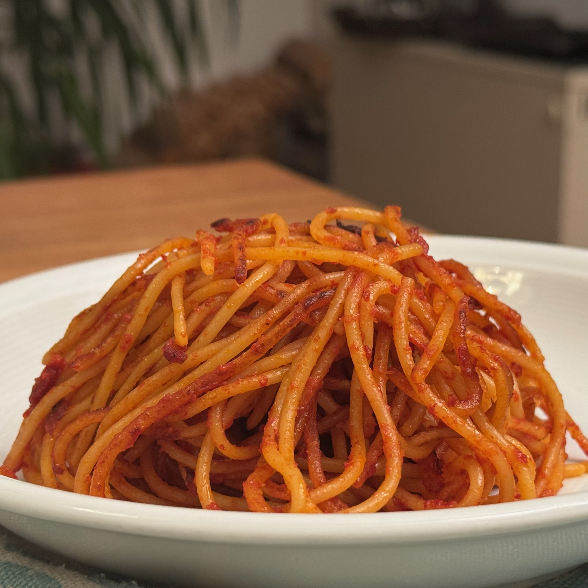
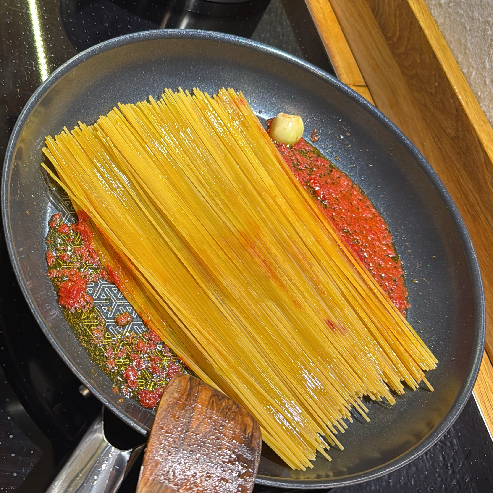

---
tags:
  - Primi
  - Pasta
  - Puglia
  - Mirko
comments: "true"
---

## 🧾 Ingredients

**In Padella**
- 4 Persone
- 320 g Spaghetti (con poco amido, tipo i Barilla)
- 1 Aglio (o aglione)
- Olio EVO
- 2 cucchiai Concentrato di pomodoro
- q Peperoncino

**Brodo di pomodoro**
- 1 cucchiaio Concentrato di pomodoro
- 300 g Passata di pomodoro
- 1 litro Acqua (o fino a cottura)
- Sale

## 👩‍🍳 Directions

- Preparate il brodo di pomodoro con sale, concentrato, acqua e passata in un pentolino e far bollire qualche minuto, tenere caldo.
- Soffriggere l'agio a pezzi grossi, il concentrato di pomodoro e il peperoncino in una pentola abbastanza grande da ospitare gli spaghetti per lungo e possibilmente anti-aderente.

- Far tostare un po' gli spaghetti nel soffritto.
- Aggiungere il brodo di pomodoro sui bordi un mestolo alla volta, e aspettare che gli spaghetti si attacchino un po'. Tra un mestolo e l'altro voltare gli spaghetti.
- Servire quando raggiungono la cottura desiderata, e comunque non senza averli leggermente sbruciacchiati.
## 💡 Tips

Ottima ricetta se vi trovate degli spaghetti Barilla o simili (quelli gialli e lucidi) di cui non sapete cosa farvene.

