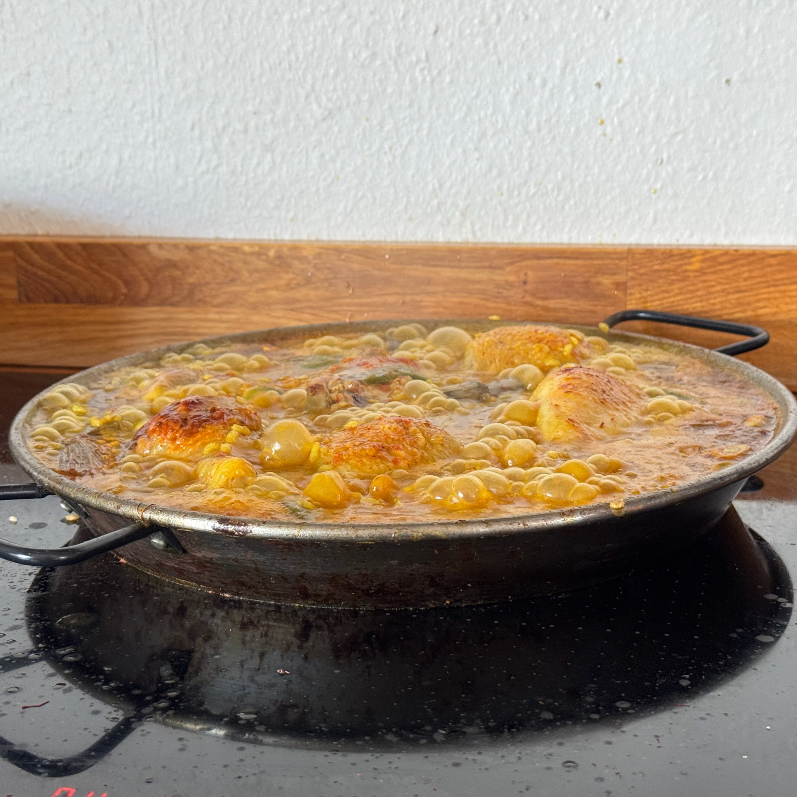

---
tags:
  - mirko
  - Allibhoy
  - Riso
comments: "true"
---

## 🧾 Ingredients

- 4 persone
- 1/2 g Zafferano tostato
- Sale
- Olio EVO abbondante
- 6 pezzi Pollo e Coniglio
- 100g Fagioli piatti
- 50g Fave
- 2 Carciofi 
- 3 Spicchi d' Aglio
- Paprica affumicata q.b.
- 1 Pomodoro pelato
- 1.5 litri Brodo di pollo
- 250 g Riso Bomba
- 3 rametti di rosmarimo

## 👩‍🍳 Directions

- Riscalda una padella dal diametro (superiore) di 23 cm moltiplicato per la radice quadrata delle persone per cui prepari la paella (32cm per 2, 40cm per 3, 46cm per 4, etc...)
- Tosta lo zafferano nella padella per pochi secondi (racchiuso nella carta argentata per comodita')
- Abbondante sale nella padella, per tutti gli ingredienti che seguiranno
- Olio d'oliva
- Padella a fuoco vivo
- Rosolare la carne a pezzi (idealmente rondelle di 2cm circa). Pollo, coniglio, braciole di maiale, a piacere. Fino a che non diventano ben marroni.
- Aggiungere i fagioli e lasciare cuocere e abbrustolire
- I carciofi
- L'aglio
- Abbassa il fuoco
- Cospargere di paprika affumicata (Pimenton)
- Aggiungi il pomodoro spappolato con la mano
- Alza il fuoco e mescola
- Cuoci 2 minuti
- Versa il brodo
- Aggiungi lo zafferano tostato
- Appena bolle aggiungi il riso (a chicco grosso) a pioggia e sistemalo nella pentola
- Non mescolare mai piu' fino a fine cottura
- Abbassare il fuoco
- Aggiungere i rametti di rosmarino
- Quando l'acqua si sara' assorbita, attendere a fuoco medio che si formi il socarrat, la crosticina croccante di riso e grasso sul fondo della pentola. Marrone non nero. Per ottenere la cottura ottimale usare le orecchie, il naso e uno stecchino per testare il fondo. 
- Lasciare riposare coperto per alcuni minuti.

## 💡 Tips

Servire con spicchi di limone

