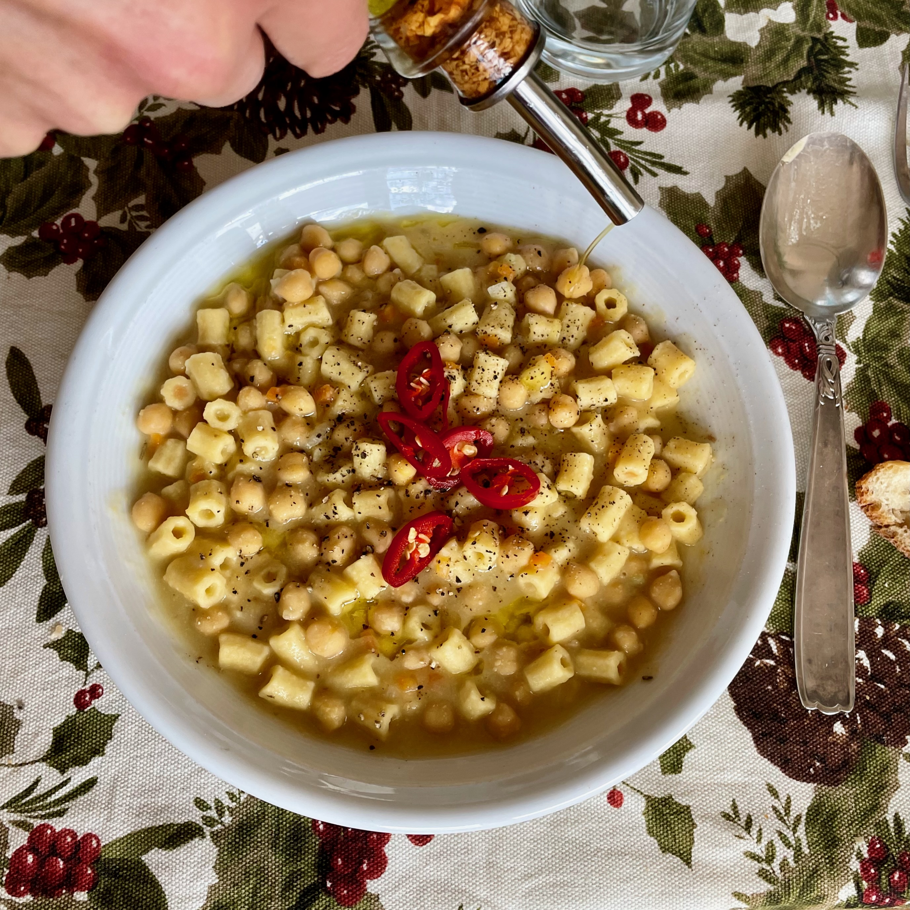

---
tags:
  - Mirko
  - Pasta
  - Primi
  - Ceci
comments: "true"
---

Nella foto presentati con tubetti freschi all'uovo (cfr. [pasta al torchio](../Basi/Pasta%20al%20torchio.md))

## 🧾 Ingredients

- 4 Persone
- 250 g di ceci secchi [cotti](../Basi/Ceci%20cotti.md) o in scatola
- 200 g pasta fresca all'uovo (o ditaloni secchi)
- 1/2 Cipolla
- 1/2 Costa di sedano
- 1/2 Carota
- 1 cucchiaio Concentrato di pomodoro
- Aglio
- Rosmarino
- Olio
- Sale

## 👩‍🍳 Directions

- Rosolare aglio e rosmarino 5 minuti a fuoco basso
- Levare il rosmarino e aggiungere cipolla, sedano e carota a cubetti piccoli o frullati
- Soffriggere una decina di minuti a fuoco basso
- Aggiungere i ceci (di cui 2 mestoli frullati con il Minipimer) con la loro acqua
- Cuocere la pasta (fresca all'uovo) per qualche minuto insieme ai ceci brodosi
  - Se si usa pasta secca che richiere una cottura piu' lunga, scolare al dente e fare insaporire ed asciugare nell'acqua con i ceci e il soffritto.

## 💡 Tips

Servire guarnendo con un filo d'olio a crudo e peperoncino fresco a rondelle per un po' di colore e brio.

Una spruzzata di limone? come ci sta?
