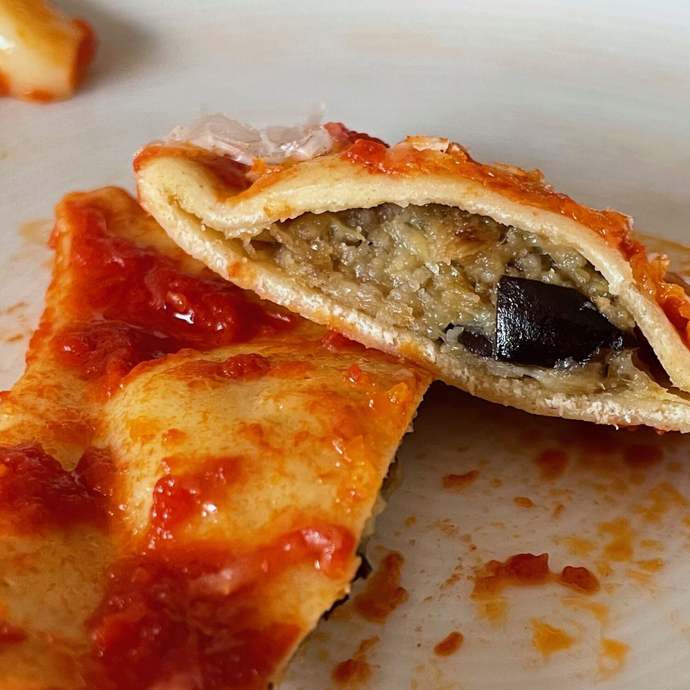

---
tags:
  - Melanzane
  - Primi
  - Mirko
  - Pasta
comments: "true"
---

## 🧾 Ingredienti

- 2 porzioni

**Ripieno**

- 100 g Melanzana a cubetti saltata croccante
- 3 Mozzarelline
- 3 cubetti di auricchio o provola
- Olio
- Sale
- Peperoncino
- Aglio
- Parmigiano e pangrattato per amalgamare

**Impasto**

- [Pasta all'uovo](../Basi/Pasta%20all'uovo) con 1 Uovo e 1 Tuorlo

**Sugo**

- Arissa
- Aglio
- Concentrato di pomodoro
- Poca passata di pomodoro
- Olio abbondante

## 👩‍🍳 Preparazione

- Impastare gli ingredienti del ripieno ancora tiepidi.
- Riempire i ravioli
- Preparare il sugo facendo stringere un po' il sugo per insaporire
- Cuocere, scolare, saltare e servire!
