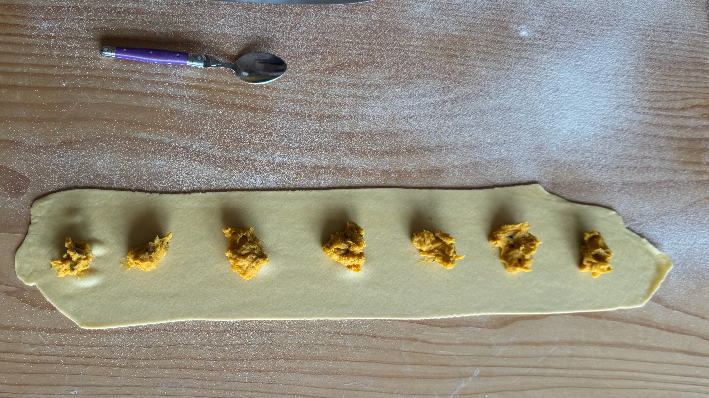

---
tags:
  - Zucca
  - Pasta
  - Mirko
  - SousVide
  - Primi
comments: "true"
---

## 🧾 Ingredients

- 6 Servings

**Ripieno**

- 500 g Zucca butternut (o Okkaido)
- 2 cm Zenzero
- Noce moscata
- Cannella
- Rosmarino
- 1 Cipolla rossa piccola
- Mascobado
- 50 g ricotta salata
- Sale

**Impasto**

- 4 Uova
- 400 g Farina di semola (o mista)

## 👩‍🍳 Directions

- Cuocere in forno per 20 - 40 minuti (fino a che sia la zucca che le fette di cipolla non sono facili da spappolare con una forchetta)
  - Le cipolle a fette cosparse di zucchero mascobado
  - La zucca a fette
- Tritare il rosmarino
- Grattugiare lo zenzero
- Grattugiare la ricotta salata
- Mescolare gli ingredienti dei ripieno

- Riempire i ravioli con l'impasto

- Chiudere i ravioli con le mani e ritagliarli

- Cuocere e condire con sugo a piacere!

## 💡 Tips

Nella foto i ravioli sono stati conditi con funghi e carote [sous-vide](../Basi/Sous%20Vide.md).
Metti in una busta funghi in quarti, carote a tocchetti, olio, aglio, sale, pepe, e aromi (prezzemolo. come stara' con la salvia?) e cuoci a 80° per un'ora o due.

Ottimi anche con burro e amaretti sbriciolati.

L’amico Nanni suggerisce la Zucca di tipo Delica .
