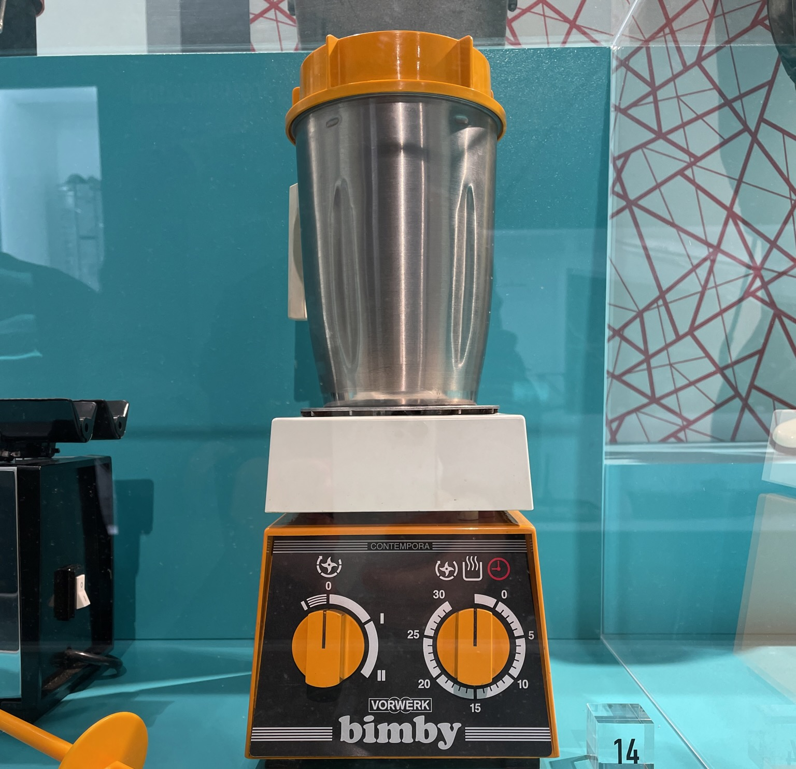

______________________________________________________________________

tags:

- Salse
- Bimby
- Basi
  comments: "true"

______________________________________________________________________

## 🧾 Ingredienti

- 4 persone
- 500 ml Latte
- 50 g Farina 00
- 50 g Burro
- Sale
- Noce moscata

## 👩‍🍳 Preparazione

- Inserire tutti gli ingredienti
  - 7' - 90° - Vel. 4
