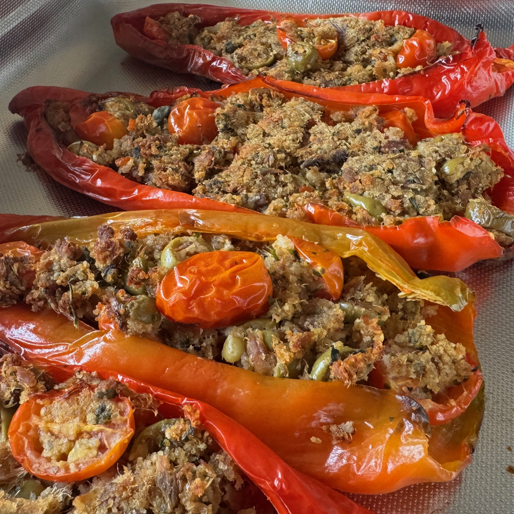
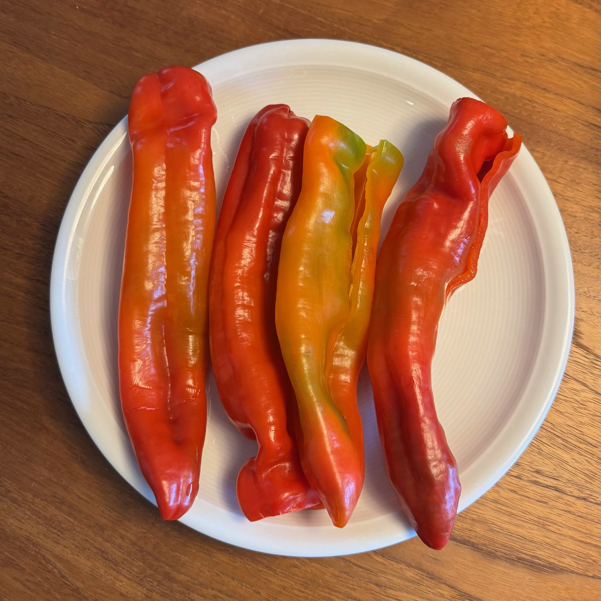
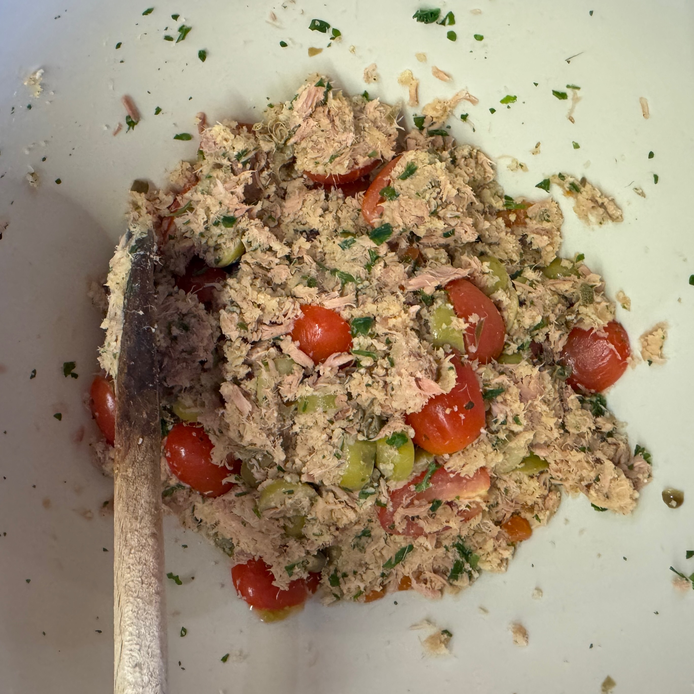
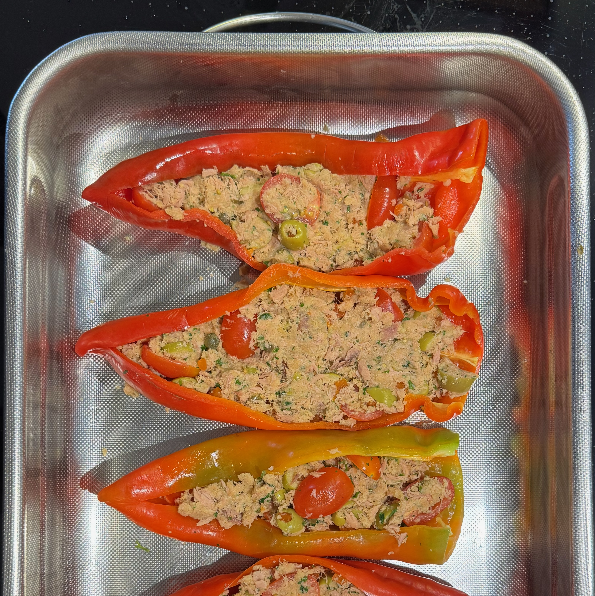

---
tags:
  - Peperoni
  - Antipasti
  - Secondi
  - Tonno
  - Mirko
comments: "true"
---

## 🧾 Ingredients

- 4 Servings
- 4 Peperoni Lunghi/Pontecorvo (Spitzpaprika)
- 4 Filetti di acciuga
- 50 g Olive verdi o taggiasche denocciolate
- 10 g Capperi dissalati
- 50 g Pangrattato
- 15 ml Olio EVO 1 cucchiaio
- 100 g Pomodorini
- 120 g Tonno in scatola (sgocciolato)
- Prezzemolo
- Pepe

## 👩‍🍳 Directions

1. Lavere e pulire i peperoni.
2. Sbollentare i peperoni per 2-5 minuti.

3. Tritare e mescolare gli altri ingredienti per il ripieno

4. Infornare 20' a 180°C

