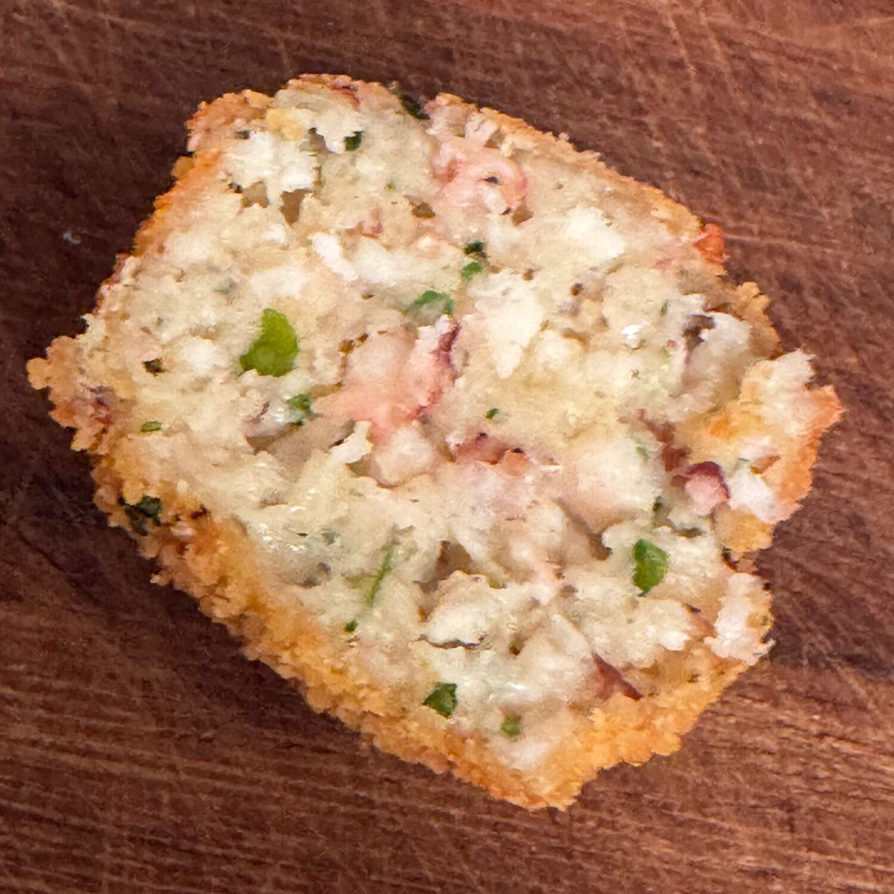

---
tags:
  - Pesce
  - Polpo
  - Salento
comments: "true"
---

## 🧾 Ingredienti

- 500 g Polpo bollito (tenere l'acqua di cottura)
- 3 foglie Alloro
- 1 ciuffo Prezzemolo
- 1 spicchio Aglio
- 150 g Mollica di pane
- 1 Uovo
- Sale
- Pepe
- Pangrattato per la panatura
- Olio per friggere

## 👩‍🍳 Preparazione

1. Bollire il polpo in non troppa acqua con l'alloro per circa 25' (sentirlo con una forchetta infilzando un tentacolo vicino alla testa)
2. Scolare e tenere l'acqua di cottura
3. In una ciotola inserire il prezzemolo tritato, l'aglio tritato, la mollica di pane spezzettata, uno o due cucchiai di acqua di cottura, uovo, sale, pepe.
4. Aggiungere il polpo tritato non troppo finemente nel tritatutto
5. Mescolare bene tutto

Formare le polpette, non troppo grosse, impanarle nel pangrattato e friggerle

## 💡 Consigli

Ottime anche come antipasto
