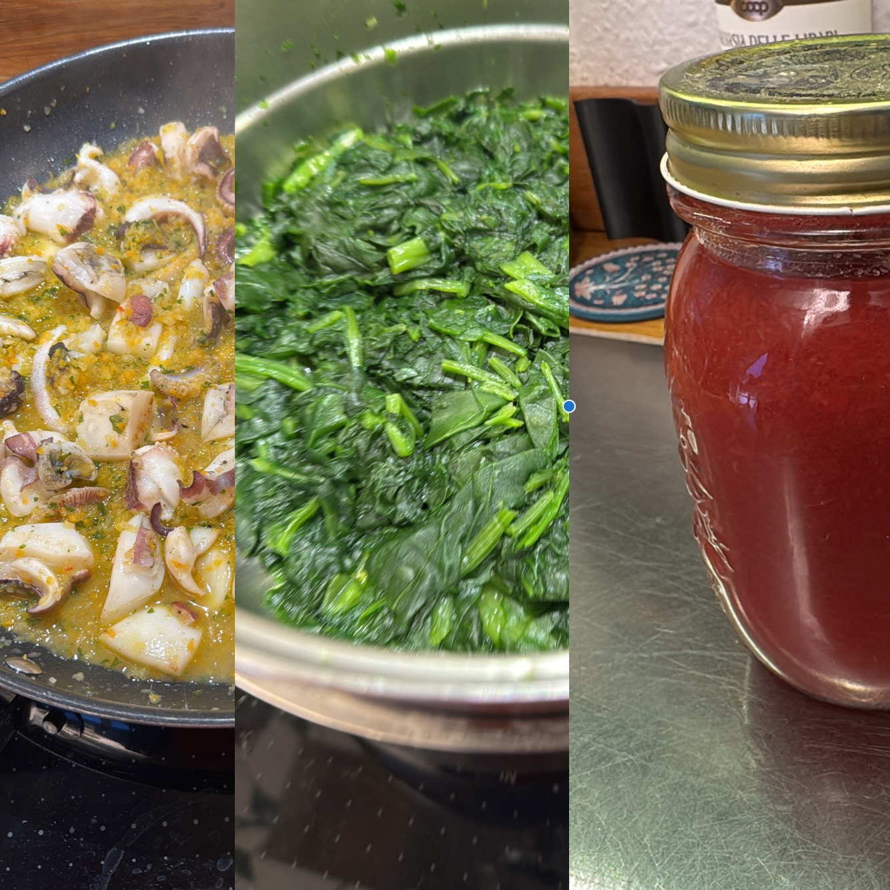

---
tags:
  - Secondi
  - Pesce
  - Spinaci
comments: "true"
---

## 🧾 Ingredienti

**Soffritto**

- Olio d’oliva
- 1 Cipolla
- 2 o 3 spicchi Aglio
- 1 Carota
- 1 Costa di sedano
- 1 Peperoncino
- Prezzemolo

**Cottura**

- 1 Seppia medio-grande (800 g)
- 1/2 bicchiere Vino bianco
- Sale
- Pepe
- 450g Salsa di pomodoro
- 400 g Spinaci

## 👩‍🍳 Preparazione

Preparare il soffritto (10’ a fuoco medio-basso) in una pentola o padella (dotata di coperchio, per le fasi successive)

Alzare il fuoco e rosolare la seppia qualche minuto

Salare, pepare e sfumare con il vino

Aggiungere il pomodoro e fare insaporire

Aggiungere gli spinaci e lasciar cuocere coperto per 30’

Aggiustare di sale e pepe

## 💡 Consigli

Servire con due belle fette di pane (di segale se lo avete) ben tostate
